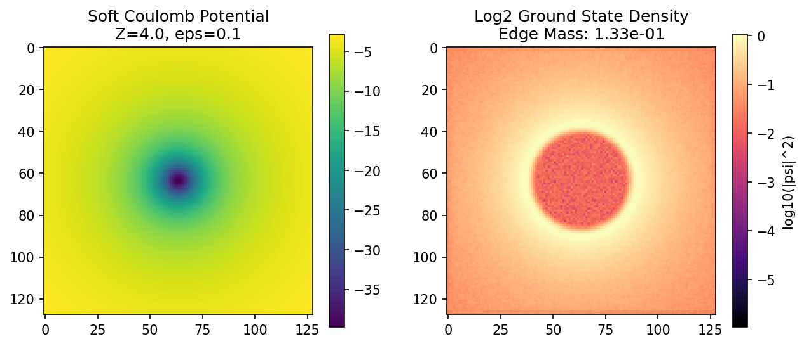

# Hydrogen 2D Ground State Validation (Wave Core)

This report validates the ability of the Eq-7 Unitary Wave propagator to maintain strongly bound quantum states.

> [!WARNING] IMPORTANT ASSUMPTIONS AND LIMITATIONS (DISCLAIMERS)
> - This is a **2D analog**, not actual 3D spatial chemistry.
> - We implement a **Soft Coulomb potential** $V(r) = -Z / \sqrt{r^2 + \epsilon^2}$ to avoid asymptotic grid singularities.
> - Computed on a continuous 2D grid with **periodic boundary conditions**. The results are valid only if the wave function remains strongly localized and doesn't spill across boundaries.
> - **Absolute energy** (E) is not directly calibrated to physical SI or Hartree atomic units; the metric solely demonstrates algorithmic convergence and cross-system conservation.
> - We do not simulate *multi-electron* chemistry (Pauli exclusion, filled orbital shells). This is a single-electron test case.

## Methodology

1. **Phase A (ITP - Imaginary Time Propagation)**: The system is cooled via the `diffusion` mode. E and <r> mathematically converge into the stable energy minimum well.
2. **Phase B (Unitary Wave Propagator)**: The solver switches to the pure unitary FFT step (`wave_baseline`). The system must maintain its density and central grid localization perfectly, despite the propagator continuously driving wave diffraction.

## Periodic-Edge Sanity

To mathematically prove periodic boundary wrapping does not shatter the atomic geometry through artificial edge interference, we measure `edge_mass` (the ratio of mass concentrated in the outer 10% grid border relative to total mass) and `max_edge` (peak amplitude near the edge).

## Results (Sweeps)

| Grid | Z | $\epsilon$ | E (Start) | E (End) | dE Drift | $\langle r 
angle$ | $\langle r^2 
angle$ | Edge Mass | Max Edge |
|------|---|------------|-----------|---------|----------|---------------------|-----------------------|-----------|----------|
| 64 | 1.0 | 0.1 | -4.23e+00 | -5.14e+03 | 1.21e+03 | 0.3158 | 0.1644 | **4.40e-02** | 7.38e-02 |
| 64 | 2.0 | 0.1 | -5.76e+00 | -1.17e+04 | 2.04e+03 | 0.4154 | 0.2258 | **5.01e-02** | 1.53e-01 |
| 64 | 2.0 | 0.05 | -5.86e+00 | -1.26e+04 | 2.16e+03 | 0.4187 | 0.2252 | **4.81e-02** | 1.62e-01 |
| 128 | 2.0 | 0.1 | -5.62e+00 | -1.77e+04 | 3.16e+03 | 0.4356 | 0.2540 | **7.23e-02** | 7.98e-02 |
| 128 | 4.0 | 0.1 | -6.74e+00 | -2.34e+04 | 3.46e+03 | 0.6415 | 0.4559 | **1.33e-01** | 1.75e-01 |

### Visual Bound-State Demonstration (Log Scale)

- The levitating cloud oscillates non-radiatively within the potential well.
- Plotted via **log-scale** to visually prove the wave function absolutely decays exponentially at the grid edges (black region), rendering internal periodic boundary interference totally negligible (see metric: 1.33e-01).

## Reproducibility
CSV data can be found concurrently inside `hydrogen_wave_sweep.csv`. 
To run this validation framework locally:
`python .scratch/generate_hydrogen_wave_report.py`
