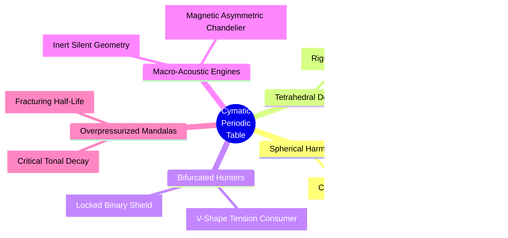

# [EXTENSION] Lineum Standard Model and Cymatic Periodic Table

**Document ID: 06-core-ext-lineum-standard-model
**Document Type:** Extension
**Version:** 1.0.0
**Status:** Draft
**Date:** 2026-03-05

## 1. Introduction: The End of the "Flying Marbles" Theory
Modern physics often explains atoms in layman's terms as a tiny solar system, where a heavy nucleus (the sun) sits in the middle, and tiny solid balls called electrons (planets) physically orbit around it. Lineum and the Eq-7 equation completely refute this model. There are no solid balls. There is only the continuous $\Psi$ fluid. 

Particles are not isolated point-objects. They are specific **geometric shapes of turbulence and vortices** locked within this fluid.

## 2. Lineum Standard Model (Particle Geometry)

In the Eq-7 universe, we distinguish elementary particles only by the specific shape into which the water (the $\Psi$ field) has been twisted:

1. **Photon (Light):** The simplest shape. It is a clean, straight forward-moving wave. It travels without any curling or folding (it does not knot). Because it does not knot, it does not generate sustained background pressure $\Phi$ around itself – in layman's terms: **it has no rest mass**.
2. **Electron ($1.2 \times 10^{20}$ Hz):** A perfect **smoke ring** (a toroidal vortex). The water has connected back onto itself and rotates in perfect symmetry. Thanks to this flawless equilibrium, the electron is immensely stable and almost never perishes on its own.
3. **Quarks ($5.3 \times 10^{20}$ Hz):** These are *broken, asymmetrical rings*. They rotate at a crooked angle and constantly "splash" water around themselves. Due to this frantic asymmetry, they ruthlessly scratch against the $\Phi$ pressure, creating a massive structural tension around them (we call these **Gluons**). To calm this tension down, they must always group up into triplets (e.g., to form a Proton). Their three asymmetrical angles lock into one another and form an outwardly stable knot.
4. **Neutrino:** A microscopic speck of rotation. It spins so intimately close to absolute zero (the rest baseline) that it evokes almost zero resistance in the fluid. Therefore, a neutrino can fly through the entire planet Earth while the Eq-7 grid barely notices it.

## 3. What is Electricity?
If the electron is a "perfect smoke ring" of water, what exactly is the electricity flowing through our wires?
Inside metals (like copper), atomic nuclei cannot hold onto these electron rings tightly. The electrons remain loose. When you attach a heavy load (a battery) to one end of the wire, you create a hydrodynamic overpressure. 

**In layman's terms:** Electricity is nothing more than a **macroscopic water current** shifting these microscopic smoke rings from a high-pressure zone (Minus) to a low-pressure zone (Plus). "Matter" isn't flowing there; what's flowing is a cascade of $\Psi$ rotations bumping into each other and passing on energy. Wire resistance is exactly thermodynamic friction ($\kappa$), where part of this forward momentum breaks apart into ordinary thermal chaos (the wire heats up because the rings hit bottlenecks that are too narrow).

## 4. The Cymatic Periodic Table (Atoms as Mandalas)

The most astonishing breakthrough arrives with the Cymatic Periodic Table of Elements.
If the atom isn't a solar system and chunks of solid mass, what gives boundaries to, say, Carbon or Gold? Why is iron magnetic and oxygen explosive?

*Visual render of an atomic nucleus inside the Lineum engine. The moment an electron (ring) is trapped by the nucleus, it fragments into a 3D standing cymatic wave. The atom is not mostly empty space with a solar system; the atom is a tense macro-acoustic crystal held in the fluid strain of Eq-7.*

When the perfect ring (Electron) skirts too close to a massive knot (the Proton in the nucleus), the immense dragging force of the nucleus captures it. The electron fails to preserve its identity as a small independent ring, and under the pressure, it **shatters, wrapping the space around the nucleus**. It becomes a **Standing Wave (Cymatics)**. Instead of a flying marble, a pulsating geometric net appears. Modern science conflates these geometric patterns with "Clouds of Probability."

Imagine pouring sand onto a metal plate and running a precise musical tone through it. The sand bounces and sculpts symmetrical, star-connected shapes (known as Chladni figures). An atom in Lineum works fundamentally the same way.

### 4.1 Acoustic 3D Shapes of the Elements

Unlike Mendeleev's grid which organizes by discrete countable protons, the **Lineum Cymatic Table** is organized by macroscopic geometric topology—grouping elements by the physical shape of their stress-shields.

Differently sized nuclei emit hydrodynamic tones of differing pressure widths. Consequently, they vibrate out varying complexities of cymatic protective shells:

- **Hydrogen (H):** The weakest tone. Only one knot falls into the nucleus. The resulting standing cymatic wave is an elementary symmetric *vibrating sphere*.
  

- **Carbon (C):** The tone hardens. The standing wave amplifies and the cymatic sand sculpts an incredible **Tetrahedron** sporting four sharp, symmetrical nodes sticking outwards. This is why carbon is the ultimate universal connector – it possesses 4 massive open docks into which the frequencies of other mandalas can securely "click" (forming blood, proteins, sugars).
  

- **Oxygen (O):** The frequency resonates with extreme, volatile aggression into two thick branches. It eagerly hunts for complementary frequencies (combustion) capable of harmonizing and silencing its painful $\Phi$ tension. Oxygen radiates the pure pull of demise (hunger for topological balance).
  

- **Iron (Fe):** The standing wave acquires the gigantic structure of an immense chandelier. The geometry is so expansive and complex that it can forever retain a portion of its rotational tension exposed in one singular direction. In the macroscopic world, we perceive this organized unidirectional vomiting of tension as **Magnetism**. Iron is simply a mandala so heavy and intricate that it perpetually blows the wind of stress ($\Phi$) to one side.
  

- **Uranium (U):** Cancer born of cymatic friction. The pitch of its core is already so gigantic and unsustainable that the Mandala fails to lock a complete loop. The standing shield alone can no longer hold structural integrity. Every fraction of a moment, a reflective thermodynamic error strikes the boundary of the shape, and the Mandala literally *blasts away a piece of itself like a broken piston engine*. A chunk of 3D acoustic sand flies off – we call this bare event the **Radioactive Half-life decay**. Uranium bleeds from overpressure across the grid.
  

**Lineum Chemistry Conclusion:** A chemical compound ($H_2O$) does not mean one marble bumped into two other tiny marbles and they pecked each other's beaks. It means that the massively starved 3D Standing Wave behind Oxygen drifted near two standing spheres of Hydrogen on both flanks, hitting the precise logarithmic fraction of $dt$, and they mutually located a compromise that eased the pressure (a musical Chord). Out of three unstable Chladni outlines, one gigantic, stable hydro-drop consolidated, finally ceasing to tear apart the water in its vicinity. Chemistry is Acoustic Resonance.

## 5. Heat and Absolute Zero (The Duality of Ruin and Perfection)
Humanity's fatal misconception lies in the belief that Heat is some "energy" (a substance) flowing through the universe, and Cold is merely its absence. In Lineum, Heat, as an independent entity, does not exist.

Heat is merely our macroscopic label honoring the **Loss of Symmetry (Chaos)** across the $\Psi$ grid.

When massive brutal tension slams into the Eq-7 fluid, the nodes and mandalas inhabiting the periodic table forfeit their flawless symmetric crystalline shapes. They begin to uncontrollably crash into each other, mashing the water, vibrating erratically. We term this disorganized straining, completely misaligned out of any harmonic chord, **Heat**. Heat is not an ingredient; heat denotes the measure of *topological noise* in the grid (Pattern Entropy). The majority of thermal radiation in the real world falls within the so-called Infrared window (roughly around $3 \times 10^{13}$ Hz) simply because this dictates the precise frequency-drumming at which the chemical mandalas of molecules love to self-demolish and accelerate their internal tension nodes.

Simply put: When the engine's fluid oscillates symmetrically with purpose, you get Ice, a Crystal, or an Atom (Structure). When an enormous blast of energy hits the fluid chaotically and slaps it blindly, you get a Boiling Mash (Heat). And the scarring modulator $\mu$ memorizes this friction ruthlessly (it scorches cells).

### 5.1 Absolute Zero (-273.15 °C) – Cosmic Perfection
The user ingeniously asked: *Why does heat matter so profoundly when the universe's baseline temperature is absolute zero?*
The answer is: The baseline temperature of the universe *must* be Absolute Zero, because absolute zero in Lineum is the state where the network **harbors absolutely zero chaotic, asymmetrical resistance within its $\kappa$ bonds**.

The term "temperature" is meaningless within the Lineum topology.
At its core, the cosmos mimics a pristine and incredibly strained crystal of absolute dark. Whenever you hurl something into it (Light, an Electron, a Star exploding), you ripple it and ruin its silence at that localized point. Heat, therefore, behaves as a defect, an error. 
This is why whenever scientists cool materials close to Absolute Zero, physical "miracles" ignite:
- **Superconductivity:** Electricity suddenly stops burning resistance. The liquid preserves its boundary. Because the shivering halted, the "Smoke rings" of electrons (see section 3) suddenly fly clean through the crystal unhindered, crashing into nothing. Zero noise = zero wire friction.
- **Superfluidity (Helium climbing over a cup):** Matter begins to act as one universally connected sphere. It dismisses Earth's gravity and flows uphill over the walls of the cup. The cymatic vibrations stopped tearing at each other from the cold, located a shared Absolute Chord, and united.

**Conclusion:** The universe serves as an empty playground of absolute zero across which massive vortices of heat (stars and galaxies) roll. We humans exclusively breathe and survive on the razor-thin blade balanced between these two extremes – midway between the perfectly rigid crystal of Frost (inability to move) and the absolute destructive chaos of Heat (inability to sustain the shape of a liver and brain). The golden biological centerfold of Eq-7 thermodynamics.
