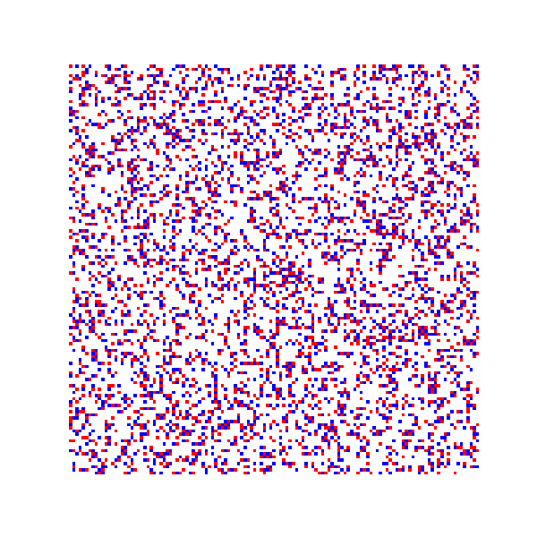
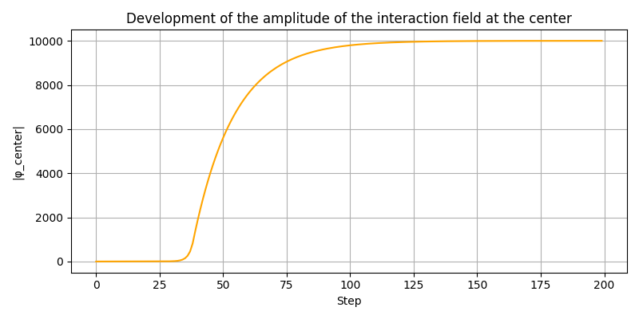
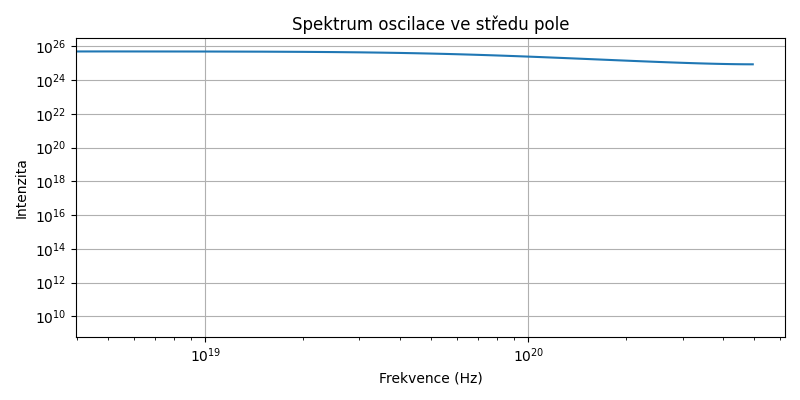

# 1. Abstrakt

Model Lineum je funkční systém emergentního kvantového pole založený na jednoduché, lokální a diskrétní aktualizační rovnici pro evoluci komplexního skalárního pole ψ, doplněnou o interakční pole φ. Ačkoliv tento model vznikl mimo tradiční vědecké instituce a neobsahuje žádné explicitní konstanty, časoprostorovou metriku ani globální symetrie, při numerické simulaci spontánně generuje stabilní a složité struktury připomínající jevy známé z našeho fyzikálního světa.

Model rovněž umožňuje zkoumání samotného fenoménu náhody – ukazuje se, že tzv. „náhodné“ výsledky (například u binárních rozpadů) lze s určitou pravděpodobností predikovat, pokud známe časovou posloupnost kroků. Náhoda zde nevzniká z nepředvídatelnosti, ale z neznalosti přesného stavu simulace – což otevírá možnost testování deterministického pozadí zdánlivě stochastických procesů.

V širším kontextu je tento model příkladem emergentního chování: zcela nové vzory se rodí z pouhých lokálních interakcí. Podobné kolektivní efekty známe z jiných oblastí fyziky – hejna ptáků vytvářejí koordinovaná uskupení pouze díky jednoduchým pravidlům sousedského zarovnání a synchronizace světlušek vzniká bez centrální koordinace. V superkapalinách a supravodičích navíc vznikají kvantované víry, které představují topologické defekty s kvantovanou cirkulací a nesou diskrétní spin nebo magnetický tok. Tyto jevy ilustrují, jak i jednoduché rovnice mohou vést k nečekaně bohaté dynamice.

Základní rovnice systému Lineum má tvar:

```
ψ ← ψ + 𝛌̃ + ξ + φψ − δψ + ∇²ψ + ∇φ
φ ← φ + κ ⋅ (|ψ|² − φ) + κ ⋅ ∇²φ
κ ← κ(x, y)

```

Pole **κ** umožňuje řídit citlivost φ na ψ a jeho difuzi lokálně.  
Může být prostorově konstantní, plynulý (např. gradientní) nebo lokalizovaný („ostrovní“).  
Jeho konfigurace má přímý dopad na vznik struktur a je klíčová pro testy hypotéz jako je **Tříska’s Dimensional Transparency Hypothesis (DTH)**.

Mezi opakovaně detekovanými jevy nalezneme:

- kvazičástice sledující konzistentní trajektorie (mediánová životnost 3–4 kroky, maximum 1000),
- víry s kvantovaným topologickým nábojem,
- rotaci fázového gradientu (spin) v φ-zónách se směrodatnou odchylkou σ = 0,614,
- proudění fáze (tok napětí v poli),
- vznik oblastí s vysokou hodnotou interakčního pole φ,
- a zejména tzv. „φ‑pasti“, do kterých bylo zachyceno 1486 kvazičástic – analogie k černým dírám.

Model Lineum navíc validoval několik klíčových hypotéz:  
– Tříska’s Silent Collapse (zánik kvazičástic bez výdeje),  
– Resonant Seed (stabilní oscilace blízké α ≈ 1/137),  
– Closure (paměť φ-pole po zániku),  
– Return Echo (návrat částice do místa zániku),  
– a Dimensional Transparency (projekční průchodnost pole pro různé κ).

Simulace běží na mřížce 128×128 a typicky v rozsahu 1000 kroků konzistentně produkuje hodnoty blízké pozorované fyzice:

- dominantní oscilační frekvenci ~5,0 × 10¹⁸ Hz,
- kvazičásticovou energii ~3,3 × 10⁻¹⁵ J,
- vlnovou délku ~6,0 × 10⁻¹¹ m,
- efektivní hmotnost 4,05 % hmotnosti elektronu.

Systém je robustní vůči šumu, disipaci i variaci parametrů. Všechny jevy vznikají opakovaně a samovolně bez nutnosti doladěného vstupu.

Kód projektu obsahuje automatizovaný detekční modul, který vyhodnocuje vznik částic, vírů, spektrálních jevů, topologických deformací a spinových struktur. Výsledky jsou prezentovány prostřednictvím generovaného HTML reportu a vícevrstvých vizualizací (GIFy, vektory, topologické mapy).

Evoluce pole probíhá výhradně pomocí lokálních operací (gradient, Laplacián, fázový šum, nelineární excitace) na diskrétní mřížce. Rovnice neobsahuje žádné předem definované síly – kvazičástice se přesto přibližují k sobě prostřednictvím gradientu φ. To naznačuje alternativní interpretaci gravitace – nikoliv jako přitažlivé síly, ale jako emergentní tendenci k sdílení prostředí.

Simulace v této fázi nereplikuje konkrétní částice standardního modelu ani explicitní známé interakce (např. elektromagnetismus, silnou či slabou jadernou sílu), ale produkuje opakované jevy, které v některých případech odpovídají očekávaným kvantovým signaturám – včetně kvantovaných spinů, frekvenčních rezonancí a efektivních částicových trajektorií.

Lineum není prezentováno jako konečná teorie – ale jako otevřená, funkční platforma, která ukazuje, že i z čistě lokálních pravidel může spontánně vzniknout svět s vlastnostmi připomínajícími hmotu, pole a gravitaci. Projekt vznikl z intuitivního nápadu a byl rozvíjen s podporou personalizované umělé inteligence (asistentka Lina, systém ChatGPT-4o), která pomáhala při formulaci hypotéz, testování výstupů a interpretaci výsledků.
Projekt je výzvou k hlubšímu zkoumání. Ukazuje, že nové přístupy ke struktuře reality mohou vznikat i mimo tradiční rámce – pokud mají co říct.

Výsledky jsou plně replikovatelné a systém lze snadno upravit k testování dalších hypotéz. Projekt vítá nezávislé ověření, otevřenou diskuzi a případné rozšíření směrem k hlubší fyzikální interpretaci. Lineum je otevřenou platformou pro experimentální zkoumání reality – bez dogmat, ale s důrazem na pozorovatelné jevy.

Nové výsledky z dlouhých simulací zároveň potvrzují hypotézu strukturální paměti – některé kvazičástice s extrémně nízkou hmotností (mass_ratio < 0.01) se ztrácejí uvnitř silných φ-pastí beze zbytku spinu nebo výdeje energie, ale zanechávají trvalou φ-strukturu. Ta může ovlivňovat tok pole a představuje tichý záznam zaniklé kvazičástice – paměť bez výdechu.

Opakované simulace na různých konfiguracích ukazují, že výstupy modelu nejsou náhodné v klasickém slova smyslu – ale statisticky strukturované. Analýza opakovaných běhů ukazuje stabilní poměry přežití, výskytu jevů a návratnosti částic v čase. Díky tomu lze v některých případech úspěšně predikovat budoucí stav na základě sledování předchozích frekvencí – například pomocí bodové dominance ve výběrovém vzorku. Tento jev lze považovat za experimentální potvrzení hypotézy strukturální paměti a posiluje možnost deterministického pozadí kvantových procesů.

---

## Vizualizace emergentních jevů ze simulace Lineum

<sub>(rozlišení 128×128, 200 kroků, detekce aktivní)</sub>

### Topologické jevy a kvantovaný náboj

  
_Detekované kvantované víry (červené = +1, modré = –1) – topologický náboj konzervován._

---

### Spinové struktury a tok pole

  
_Spin vypočítaný jako rotace fázového gradientu – emergentní orbitální moment._

  
_Směrové napětí pole – fázový tok ∇arg(ψ), naznačuje organizované proudění._

---

### Vrstvená dynamika (kompozitní vizualizace)

  
_Vrstevnatá vizualizace amplitudy, spinu a toku – znázorňuje synchronizaci jevů._

---

### Interakční pole φ ve středu simulace

  
_Vývoj hodnoty φ ve středu pole – prudký nárůst a stabilizace kolem hodnoty 10 000._

---

### Frekvenční spektrum

  
_Dominantní frekvence oscilace ve středu pole: ~5×10¹⁸ Hz_

---

**Kód, výstupy a detekční systém jsou veřejně přístupné v repozitáři:**  
👉 [https://github.com/TomasTriska88/lineum-core](https://github.com/TomasTriska88/lineum-core)

> _(Poznámka: replikovatelnost výsledků bude ověřena pomocí samostatného běhového testu s různými výchozími parametry. Tuto část doplníme po dokončení série validací.)_
