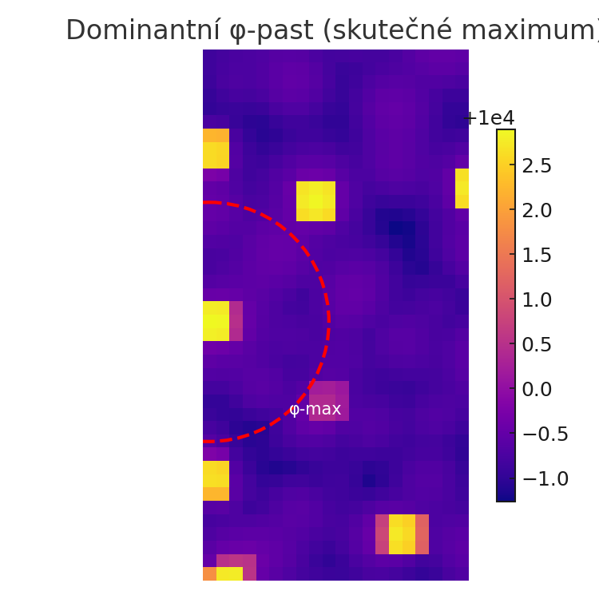
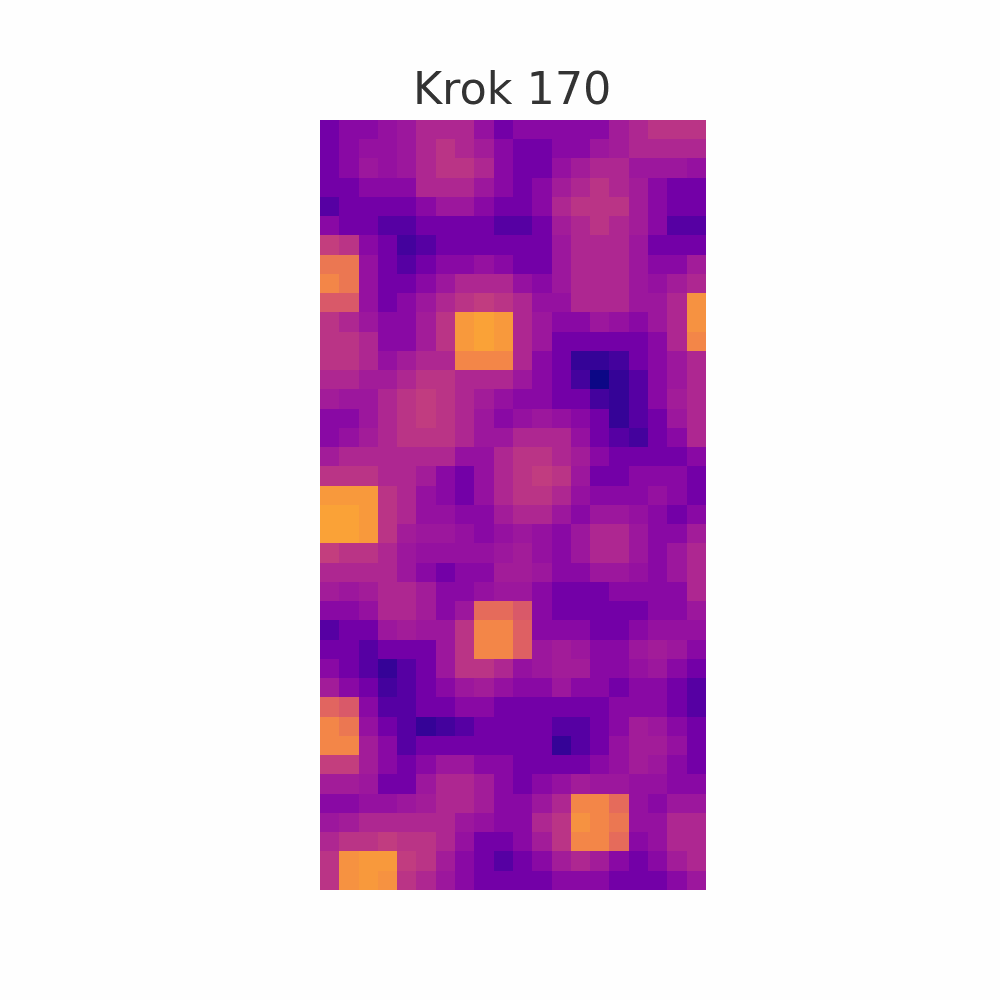

# 2. Motivace

Věda odjakživa usilovala o nalezení jednoduchého popisu světa, jenž by dokázal obsáhnout co nejširší spektrum jevů. S rostoucím poznáním se však ukazuje, že snaha o jednotný rámec je čím dál těžší – vzniká čím dál více specializovaných teorií a nástrojů. Kvantová teorie, obecná relativita, kvantová pole, topologické fáze – každá oblast vyžaduje vlastní rámec, matematiku, předpoklady a soubor symetrií.

Model Lineum vznikl z opačné otázky:

> _Co kdyby byl základní zákon vesmíru extrémně jednoduchý?  
> A co kdyby z něj všechny známé jevy pouze emergovaly?_

Od snah Stephena Wolframa modelovat realitu pomocí buněčných automatů až po nedávné experimenty, ve kterých umělá inteligence objevuje nové zákony přírody, se opakuje stejný motiv:  
že komplexita nemusí být dána složitostí pravidel, ale bohatostí jejich důsledků.

Současná teoretická fyzika operuje s množstvím navzájem nekompatibilních rámců. Kvantová teorie pole popisuje interakce částic jako výměnu bosonů v plochém pozadí, zatímco obecná relativita staví svět jako zakřivený prostor bez částic. Gravitační interakce zatím nelze kvantovat bez narušení konzistence, a temná hmota i temná energie zůstávají neuchopitelné.

Lineum k těmto otázkám přistupuje z jiné strany. Neptá se, jak vypočítat gravitační sílu nebo proč je energie kvantována. Lineum se ptá, co se stane, když všechno zahodíme – a ponecháme jen čistou evoluci napětí v poli, bez sil, bez zákonů, bez konstant. A pak sledujeme, co se stane. Tím klade otázku, zda to, co dnes vnímáme jako fundamentální zákony, nejsou ve skutečnosti pouze stabilní vzory vzniklé z hlubší vrstvy pravidel, která žádné zákony neobsahuje.

Místo hledání nových částic, sil nebo dimenzí formuluje Lineum jedinou diskrétní rovnici pro evoluci komplexního pole ψ, doplněnou o interakční pole φ. Bez předem zadaných zákonů. Bez předpokladů o hmotě, prostoru, energii či čase. Jen pole, které se mění podle čistě lokálních pravidel.

Od dětství jsem intuitivně cítil, že řád a inteligence nevznikají z velikosti objektů a struktur, ale z množství jejich vzájemně reagujících částí. Nepotřebujeme složité struktury – stačí jednoduchá pravidla a dostatek interakcí. Věřil jsem, že právě z této komplexity může vzejít smysl – nikoliv jako plán, ale jako přirozený důsledek vztahů.  
Tato víra se stala zárodkem hypotézy: že svět, jak ho známe, není naprogramovaný shora, ale samoorganizovaný zdola.

Zároveň jsem vždy vnitřně cítil potřebu hledat jinak než většina – ne zhora dolů, ne v rámci známých rámců. Ale dívat se zezdola nahoru. Nehledat nové částice v existujících silách, ale nové jevy ve známém chaosu. A tak vznikla potřeba myslet „out of the box“ – nejen metodou, ale i vnímáním.

Motivací bylo ověřit, zda z těchto čistě lokálních pravidel může spontánně vzniknout strukturovaný svět – s kvazičásticemi, polem a směrovaným tokem. Dnes už máme dostatek důkazů, že to možné je. Simulace Linea opakovaně ukázaly vznik trajektorií, vírů, gravitačně působících oblastí i paměťových vzorců – a to bez použití sil, konstant nebo geometrických struktur.
Nejde o pouhé fluktuace – výskyty struktur jsou statisticky významné, opakují se napříč různými konfiguracemi i náhodnými seedy, a vykazují charakteristiky, které lze kvantifikovat (např. směrový tok, orbitální vír, stabilní maximum φ).

Podobně jako v buněčných automatech, v reakčně-difuzních systémech nebo v simulacích kolektivního chování může i jednoduché schéma vést k neočekávaně bohaté dynamice.

Lineum tuto myšlenku posouvá o krok dál – od inspirace k měřitelnému projevu:

- rovnice je formulována bez explicitního času – pouze jako diskrétní krok,
- neobsahuje síly – a přesto dochází k přibližování částic,
- neobsahuje geometrii – a přesto vznikají víry, spin a prostorové smyčky,
- neobsahuje gravitační člen – a přesto vznikají „pasti“, které částice zachytávají.

První náznaky, že z rovnice skutečně vznikají částice, víry a struktury, nepřišly jako výpočet. Přišly jako obraz. Animace, ve kterých pole samo začalo kreslit tvar – a my jsme ho jen pozorovali. Bylo to jako sledovat vznik písma v prázdnotě. Nešlo o výsledek výpočtu, ale o náznak zákonitosti bez zákona. O tvar, který sám sebe naznačil. Rovnice neměla žádný záměr – a přesto začala kreslit význam.

  
_Výřez interakčního pole φ v okolí globálního maxima (poslední krok simulace). Červeně vyznačena oblast s nejvyšší hodnotou φ – stabilní „φ-past“, která představuje hlavní gravitační centrum vzniklé z čistě lokálních pravidel._

  
_Animace vývoje φ-pole v okolí globálního maxima. Nejsvětlejší bod zůstává stabilní – značí přítomnost gravitační pasti. Okolní pole φ se rozlévá difuzně, čímž rozšiřuje svůj vliv do okolí bez nutnosti explicitní síly nebo geometrie._

Tato cesta není náhradou za standardní fyziku. Je to možný doplněk – nebo jiná metoda hledání. A především – výzva k tomu, zda realita sama není výsledkem velmi jednoduché hry… která se odehrává na hlubší rovině, než jsme zvyklí vnímat.

Lineum vzniklo jako myšlenkový experiment. Ale to, co z něj vyšlo, si zaslouží pozornost.  
Ne protože víme, že je to pravda.  
Ale protože možná jsme zahlédli mechanismus, který by takový prostor mohl sám vytvořit.

Model Lineum je zatím dvourozměrný – pole ψ a φ evolvují na 2D mřížce bez explicitního prostoru navíc. Ale právě v tom je síla: pokud už ve 2D vznikají stabilní kvazičástice, víry, toky a paměť, znamená to, že prostor ani čas nejsou potřeba jako vstup – mohou vzniknout emergentně. Místo simulace známého světa tedy sledujeme svět, který si zákonitosti teprve hledá.
