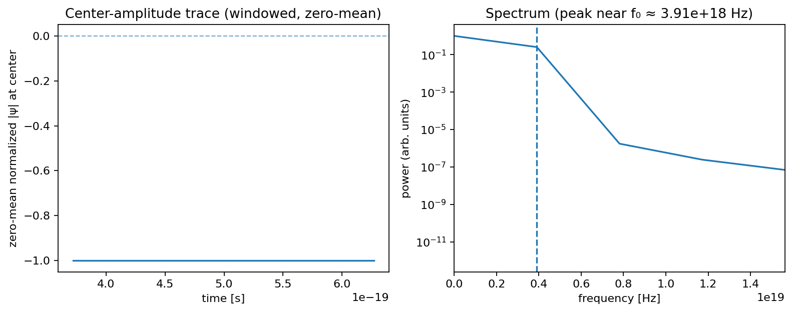

**Document ID:** lineum-core  
**Version:** 1.0.9-core
**Status:** Draft  
**Equation:** Eq-4 (canonical; κ static)  
**Scope:** 2D, periodic BCs
**Date:** 2026-02-14

**DOI:** 10.5281/zenodo.16934359  
**How to cite:** Tomáš Tříska. _Lineum Core (v1.0.9-core)._ 2026. DOI: 10.5281/zenodo.16934359.
_This manuscript corresponds to Git tag **v1.0.9-core** and the evidence bundle in `output/` (commit-stamped in each HTML)._

> **Canonical Scope (v1.0.x)**  
> **Equation:** Eq-4 (κ static) • **Dim.:** 2D • **BCs:** periodic • **Grid:** 128×128  
> **Δt:** 1.0×10⁻²¹ s • **Seed:** 41 • **RUN_TAG:** spec6_false_s41  
> **κ-mode:** constant • **Noise:** zero-mean, σξ ≪ 1 (canonical low)  
> **Operators:** ∇ (central), ∇² (5-point von Neumann)  
> **Out of scope:** 3D, time-varying κ, zeta/RNB correlations, Return Echo, Vortex–Particle coupling, and other interpretive add-ons. These are intentionally excluded from the core and deferred to **future work**; they are not part of this submission. **Structural Closure is in scope for v1.0.x** and is treated as an operational consequence of the φ center-trace half-life metric (see §5.4).

# 1. Abstract

Lineum is a functional model of an emergent quantum field based on a simple, local, and discrete update equation for the evolution of a complex scalar field ψ, coupled with an interaction field φ and an experimental tuning field κ. The model does not assume any explicit constants, spacetime metric, or global symmetries, yet numerical simulations consistently produce stable and complex structures resembling phenomena known from physics.

The system evolves according to a coupled three-field update rule (see [Equation (1)](#eq1) (Version 4) in Section 3), which governs the primary field ψ, the interaction field φ, and the spatial tuning map κ.

**Terminology.** We use **linon** to denote a **stable, localized excitation** of |ψ|² (a quasi-particle analogue emergent from the Lineum rule). It is **not** a fundamental particle. On first mention we may write “linon (localized excitation)”; thereafter we use **linon**.

**Pronunciation (model name).** _Lineum_ = Czech **/ˈlɪ.nɛ.um/** (short **i**, three syllables: “**LIH-neh-oom**”, stress on the first).  
For readers in English: **/ˈlɪniəm/** (UK/US ≈ “**LIH-nee-um**”).  
_Not_ “LAI-nee-um” or “lee-NAY-um”.

**Pronunciation.** _linon_ = Czech **/ˈlɪnon/** (short **i** as in “list”, stress on the first syllable).  
For readers in English: **/ˈlɪnɒn/** (UK ≈ “LIH-non”) or **/ˈlɪnɑːn/** (US ≈ “LIH-nahn”).  
_Not_ “LAI-non”.

Repeated simulations robustly generate (v1 core evidence):
– stable localized excitations (**linons**) with a reproducible dominant tone \(f_0\),
– reproducible spectral strength (**SBR**, ±2-bin guard) with 95% CIs,
– **topological neutrality** with logged vortex counts/charge,
– a persistent **spin aura** (time-averaged curl of ∇arg ψ) around linons,
– and a measurable **center-trace φ half-life**.

All listed items are directly reported in the HTML evidence (Quasiparticle Properties, Spectral metrics, Topology metrics, “Spin aura — averaged curl map”, and φ center trace). Claims requiring κ-dynamics, thermodynamics, or SM identification are out of scope for the v1 core.

Within the v1 core evidence bundle, the validated items are limited to: (i) a stable localized excitation (“linon”) with a reproducible dominant tone \(f_0\) (reported as a windowed estimate with CI; centroid/interpolated peak where applicable); (ii) reproducible spectral strength (SBR) and topology neutrality; (iii) the center-trace φ half-life together with **Structural Closure** (localized, long-lived φ remnants after linon decay); and (iv) a persistent phase-gradient rotation (“spin aura”) around linons, as reported in the HTML (“Spin aura — averaged curl map”). **Return Echo** and any κ-dynamics (“Dimensional Transparency”) remain out of scope for the v1 core and are deferred to the experimental/extension track (see the dedicated whitepapers).

For the canonical parameter choice (Δt fixed and SI constants applied post hoc), the dominant oscillation can be expressed in familiar physical units for **scale illustration only**. For example, when written in SI units (refined snapshot; RUN_TAG `spec6_false_s41`, commit `875fc4e`):
these values are not used as acceptance thresholds or constraints anywhere in the core validation.

- dominant oscillation frequency ≈ **1.710×10²⁰ Hz** [**9.82×10¹⁹**, **2.47×10²⁰**],
- linon energy (display-only) ≈ **1.13×10⁻¹³ J** ≈ **707 keV**,
- wavelength (display-only) ≈ **1.75×10⁻¹² m** (0.00175 nm),
- effective mass (display-only) ≈ **1.38×** of the electron mass (**m/mₑ ≈ 1.384**).

These SI-anchored values are **unit conversions of the canonical tone f₀**, not additional constraints on the model or evidence that Lineum directly realizes any specific physical scale.

> **Interpretation note (v1).** The “effective mass” value is a **unit-conversion from the dominant frequency** \(f_0\) via \(m = h f_0 / c^2\). It is provided **only** as an intuition aid for scale (refined snapshot: RUN_TAG `spec6_false_s41`, commit `875fc4e`), **not** as a claim of an intrinsic rest mass.

> **Reports alignment (v1).** In the refined snapshot, the SI-anchored values (E, λ, display-only m/mₑ) are computed directly from the reported \(f_0\) (manifest/CSV) using fixed SI constants. This remains a **scale indicator**, not a rest-mass claim.

> **Non-identification (v1).** A **linon** is a _stable, localized excitation_ in the Lineum field, **not** a Standard-Model particle. The numerical anchors in the Abstract (f₀, E, λ, and the display-only mass ratio m/mₑ) are provided **to indicate scale only**. They must **not** be read as an identification with electrons, neutrinos, or any SM species. See “Terminology” (linon is not a fundamental particle) and the **Interpretation note (v1)** on display-only mass.

All phenomena emerge without fine-tuned initial input, relying solely on local operations on a discrete grid. No predefined forces are included. Particles tend to drift along +∇φ (toward increasing φ); we describe this as environmental guidance rather than any gravitational claim.

The system is reproducible, robust to noise and dissipation, and open for independent verification and further hypothesis testing.

**Out-of-scope clarifier (v1 core).** We **do not** claim: (i) predictability of “random” outcomes or a deterministic substrate for stochastic processes; (ii) any κ-dynamics phenomena (e.g., “Dimensional Transparency”); (iii) thermodynamic quantities (T, S) or fluctuation–dissipation calibration; (iv) identification with Standard-Model particles; or (v) gravitational analogies. These topics are deferred to the experimental/extension track and are not part of the v1 core evidence.

**Graphical abstract.**

<p align="center">
  
</p>

<sub>Note: this mark is a visual mnemonic only; it carries no physical claim and is not used in any metric.</sub>

**Icon legend (mnemonic only — no physical claim).**

- **Fish (upper) → κ (tuning / sensitivity).**  
  _Why:_ the “eye” dot suggests a **sensor**, the body an **oriented agent** responding to local cues; κ controls local **susceptibility** and tuning (κ·α, κ·β), i.e., how the medium responds to gradients.
- **Spiral (lower-left) → ψ (oscillation / flow).**  
  _Why:_ a spiral visually encodes **periodicity and phase circulation**; ψ is the time-like **carrier** with canonical tone **f₀**, from which we derive SI conversions (E, λ, display-only m/mₑ).
- **Leaf (right) → φ (memory / envelope).**  
  _Why:_ the broad lamina reads as an **envelope**, while venation evokes a stored **pattern/context**; φ is the **memory** field used in nearby/field means and the center-trace half-life metric.
- **Outer loop → circulation / interplay.**  
  _Why:_ a closed path **ψ → φ → κ → (back)** as a mnemonic of interplay; **no law or metric is implied**.
- **Design note.** Uniform line weight → no hierarchy; shapes are **not** used as data encodings anywhere in the paper.

_Directional mnemonic:_ κ → ψ → φ → κ; no direct φ → ψ arrow is implied in the core (memory influences the medium/tuning, not the carrier itself).

> **Three-field flow.** The mark depicts the triad **ψ–φ–κ** in balance: ψ (oscillation / flow), φ (memory / resonance), κ (tuning / sensitivity). It is a visual mnemonic only; the **canonical Equation (1)** defines the model.

> **Core thesis (v1).** We demonstrate a _reproducible, parameter-light_ emergence of a stable localized excitation (“linon”) with a dominant tone \(f_0\) that is (i) strongly spectral-dominant (high SBR), (ii) SI-anchored for scale illustration, and (iii) reported with uncertainty (windowed CI). The contribution is methodological: clear numeric anchors + guardrails that turn a fragile emergent phenomenon into an **auditable, falsifiable** object others can probe and extend.

> **Falsifiable checks (v1).**  
> **(C1) Window resolution:** Re-run with `W = 512` (keeping `Δt = 1.0e−21 s`). Expect the dominant tone estimate to remain stable (peak near the same FFT region, centroid \(f_0\) consistent) and the reported `f₀` to match within **±0.5%** of the canonical value (see §4.3.1 bands).  
> **(C2) Temporal refinement (Δf preserved):** Halve the time step and double the window (`Δt → Δt/2`, `W → 2W`) so that `Δf = 1/(W·Δt)` stays constant. Expect `f₀` to match within **±0.5%** (centroid estimate; no requirement of exact bin-centering).  
> **(C3) Grid size:** Re-run on `256×256` with identical parameters. Expect `f₀` within **±0.5%** and SBR within the **±10%** acceptance band of §4.3.1.

# 2. Motivation

Many approaches in theoretical physics rely on continuous equations embedded in a predefined spacetime geometry, with global constants and symmetries fixed a priori. Such frameworks limit the exploration of systems where both the geometry and the interaction rules could emerge from purely local processes.

Lineum is designed as a minimal model to investigate whether complex, stable, and potentially physics-analogous structures can arise from:
– simple, local update rules,
– no predefined global metric or constants,
– and interactions mediated by emergent fields.

The key motivation is to test if macroscopic phenomena, such as particle-like excitations, field-mediated interactions, and stable wave patterns, can originate without embedding them explicitly into the governing equations.

By isolating and quantifying these emergent behaviors, Lineum offers a controllable environment to evaluate which observed effects might have analogues in known physics, and which are unique to discrete, metric-free systems.

# 3. Equation

The evolution of the system is defined on a discrete 2D grid by three coupled update rules for:
– the primary complex scalar field ψ,
– the interaction field φ,
– and the (static) tuning field κ (spatial map).

The canonical form is:

**Equation (1) — Canonical Lineum update (Version 4)** <a id="eq1"></a>

<!-- prettier-ignore-start -->
| Equation | Description |
| --- | --- |
| **ψ ← ψ + 𝛌̃ + ξ + φψ − δψ + ∇²ψ + ∇φ** | primary field evolution |
| **φ ← φ + α (&#124;ψ&#124;² − φ) + β ∇²φ** | interaction field response |
| **κ ← κ(x, y)** | spatial tuning map |
<!-- prettier-ignore-end -->

> _For the full development history of this equation, see_ [Appendix A: Equation History](lineum-core-equation-history.md).

**Legend (symbols & operators)**

<!-- prettier-ignore-start -->
| Symbol | Type / Range | Role | Default / Notes |
|---|---|---|---|
| ψ(x,y,t) | ℂ | primary field; &#124;ψ&#124;² = density, arg ψ = phase • linons = localized &#124;ψ&#124;² maxima |
| φ(x,y,t) | ℝ | interaction / memory field | accumulates response to &#124;ψ&#124;² |
| κ(x,y) | ℝ⁺ (static) | spatial tuning map | no time evolution; often normalized to [0,1] |
| 𝛌̃(x,y,t) | ℂ | external stimulus | 0 unless stimulus experiments |
| ξ(x,y,t) | ℂ | noise (zero-mean) | optional; amplitude σ_ξ ≪ 1 |
| δ | ℝ₊ | damping in ψ-update | local, ≥ 0 |
| α | ℝ₊ | coupling | from &#124;ψ&#124;² to φ |
| β | ℝ₊ | diffusion | φ diffusion strength |
| ∇ | operator | discrete gradient | central differences |
| ∇² | operator | discrete Laplacian | 4-neighbour (5-point von Neumann; implemented via `diffuse_complex()` in the reference code) |
| BCs | — | boundary conditions | periodic in x,y |
| α_eff, β_eff | — | effective params | α_eff = κ·α, β_eff = κ·β (κ modulates α,β) |
<!-- prettier-ignore-end -->

**Canonical parameters (spec6_false_s41)**

<!-- prettier-ignore-start -->
| Param | Meaning                         | Canonical value |
| :---: | ------------------------------- | :-------------- |
|   α   | φ relaxation toward &#124;ψ&#124;² | 7.0×10⁻⁴        |
|   β   | φ diffusion strength            | 1.5×10⁻²        |
|   δ   | ψ damping per step              | 4.62×10⁻³       |
|  σξ   | noise amplitude in ψ            | 5.0×10⁻³        |
|   κ   | spatial tuning (static, const.) | 0.5 everywhere  |
<!-- prettier-ignore-end -->

_Scope note (canonical dimensionality)._ All results in this core paper use a **2D discrete grid with periodic boundary conditions**. Any 3D extensions or non-periodic boundaries are treated as **supplementary variants** and are not part of the canonical Eq. 1.

**Sign convention.** The +∇φ term in the ψ-update induces drift toward increasing φ (movement along the φ-gradient).

**Note (κ as static map).** In the canonical rule, **κ** is a **static spatial map** (no time evolution). Any experiments that evolve κ belong to supplementary variants, not to Eq. 1. In applications, κ may locally scale parameters (e.g., α_eff = κ·α, β_eff = κ·β), but it does not replace **α** or **β** in the φ-update.

No explicit spacetime geometry, global constants, or long-range interactions are predefined. All behavior results from repeated local updates of these fields.

## 3.1 Numerical scheme & stability (canonical)

**Discrete operators (periodic, $\Delta x = \Delta y = 1$).**

$$
\nabla_x f_{i,j} = \frac{f_{i+1,j}-f_{i-1,j}}{2},\quad
\nabla_y f_{i,j} = \frac{f_{i,j+1}-f_{i,j-1}}{2}
$$

$$
\nabla^2 f_{i,j} = f_{i+1,j} + f_{i-1,j} + f_{i,j+1} + f_{i,j-1} - 4\,f_{i,j}.
$$

In the reference implementation this four-neighbour stencil is realized by the helper function `diffuse_complex(...)` in the φ-update; there is **no** 9-point (diagonal) Laplacian in the canonical v1 run. Wider stencils (e.g., 9-point) are treated as exploratory variants outside the v1 core evidence.

**Time stepping.** Explicit Euler with fixed $\Delta t = 1.0\times 10^{-21}\,\mathrm{s}$ (canonical anchor).

**Stability sanity.** For diffusion-like terms a heuristic CFL bound is

$$
\Delta t \lesssim \mathcal{O}\!\left(\frac{(\Delta x)^2}{4 D_{\mathrm{eff}}}\right).
$$

In practice we verify stability empirically via Section 5 metrics (SBR, topological neutrality, and $\phi$ half-life) on the canonical run; windowed estimates with 95% CIs are reported in the HTML report.

# 4. Method

Simulations are performed on a discrete square grid with periodic boundary conditions. Each step updates ψ and φ according to the canonical equation; **κ is a static spatial map** that is sampled (not evolved) at each step. We apply the discrete Laplacian for diffusion terms and nearest-neighbor operations for gradients.

## 4.1 Grid and Initialization

– **Canonical grid:** 128×128 cells (periodic BCs). All results reported in this core paper use this grid.  
– **Exploratory grids (non-canonical):** 256×256 or 512×512 may be used for visualization or stress tests, but they are not part of the canonical results.  
– **Initial ψ:** complex noise with small amplitude.  
– **Initial φ:** uniform background with small perturbations.  
– **κ:** static spatial map (constant/gradient/localized) depending on the test.

## 4.2 Update Procedure

At each timestep:

1. Compute Laplacians and gradients for ψ and φ.
2. Apply the update rules for ψ and φ (**κ is static and only sampled**).
3. Optionally add controlled noise ξ to test stability.
4. Record intermediate states for analysis.

#### One-step update (canonical Eq-4)

**Context:** periodic BCs, Δx = Δy = 1, explicit Euler; κ is static (constant map in the canonical run).

```python
# periodic BCs, Δx=Δy=1, explicit Euler
for t in range(T):
    # spatial derivatives
    lap_psi  = laplacian(psi)          # 5-point (von Neumann)
    grad_phi = gradient(phi)           # central differences
    lap_phi  = laplacian(phi)

    # effective parameters (κ is static)
    alpha_eff = kappa * alpha
    beta_eff  = kappa * beta

    # ψ-update
    psi = psi + lambda_tilde + xi + phi*psi - delta*psi + lap_psi + grad_phi

    # φ-update
    phi = phi + alpha_eff*(np.abs(psi)**2 - phi) + beta_eff*lap_phi

    # optional logging/detectors
    if t % LOG_EVERY == 0:
        save_state(...)
```

## 4.3 Reproducibility

All runs are initialized with fixed random seeds to ensure identical outputs when rerun.  
Simulation parameters and κ-maps are stored alongside results to allow exact replication.

#### 4.3.1 Cross-Implementation Replication (advisory)

We do not require bit-for-bit equality across languages/backends. Small numerical differences are expected (RNG streams, FFT/Laplacian kernels, rounding). For v1, replication is defined by metric tolerances on the canonical run (`spec6_false_s41`):

– **Dominant frequency f₀:** within ±0.5%  
– **SBR (±2-bin guard):** within ±10%  
– **Topology neutrality:** fraction of steps with |net charge| ≤ 1 within ±3% (abs.)  
– **Lifetimes:** median in [2,5] steps; max ≥ 500 steps  
– **φ half-life (center):** within ±20%  
– **Vortex counts/frame:** within ±10%

**Precision note.** All reference runs use IEEE-754 double precision (float64). Language choice (Python/Julia/C++/…) does not change numerical semantics; replication is evaluated by the metric tolerances above, not bitwise equality.

Replicators must pin `Δt`, pixel size, grid size, seed, κ-mode, and use the provided manifest. Cross-language runs are encouraged; comparisons should be reported via these metrics rather than pixel-wise diffs.

## 4.4 Detection of Phenomena

Detected phenomena in the core study include:
– formation and motion of **linons**,
– vortex creation and annihilation,  
– phase gradient rotation (spin),  
– φ-trap formation and particle capture.

Detection is performed using automated field analysis:
– tracking |ψ|² maxima for particle positions,  
– identifying vortex cores via phase winding,  
– mapping φ-gradients to evaluate interaction tendencies.

## 4.5 Output

For each run, the system generates:

- **CSV (per run):** `*_amplitude_log.csv`, `*_spectrum_log.csv`, `*_phi_center_log.csv`, `*_topo_log.csv`, `*_trajectories.csv`, `*_multi_spectrum_summary.csv`, `*_spin_aura_profile.csv`, `*_metrics_summary.csv`.
- **PNG (figures):** `*_spectrum_plot.png`, `*_topo_charge_plot.png`, `*_vortex_count_plot.png`, `*_spin_aura_map.png`, `*_phi_center_plot.png`.
- **GIF (animations):** `*_lineum_amplitude.gif`, `*_lineum_spin.gif`, `*_lineum_vortices.gif`,
  `*_lineum_particles.gif`, `*_lineum_flow.gif`, `*_lineum_full_overlay.gif`.

Filenames are shown without the `RUN_TAG_` prefix for readability; see Appendix A for the prefix convention.

## 4.6 Reproduction Manifest (canonical run)

This manifest pins all run-level switches for the canonical reference used in this paper.

- **RUN_TAG:** `spec6_false_s41`
- **Evidence run dir (snapshot):** `output_wp/runs/spec6_false_s41_20260214_101645`
- **Seed:** `41`
- **Grid:** `128 × 128` (periodic BCs)
- **Steps:** `2000`
- **Precision:** `float64` (IEEE-754)
- **Δt (time step):** `1.0e-21 s` (canonical)
- **κ-mode:** `constant` (static spatial map; no time evolution)
- **Equation:** Eq-4 (canonical update rule; see Eq. (1))
- **Primary spectral metric:** power spectrum `|FFT(x)|^2` with a `±2`-bin guard around `f0`
- **Detection conventions:** as fixed in Appendix A (no amplitude gating for CSV/metrics; vortex gating is visualization-only)
- **α (reaction_strength):** `7.0e-4`
- **β (φ diffusion):** `1.5e-2` (computed as `0.30 × diffuse_complex(rate=0.05)`)
- **δ (ψ damping):** `4.62e-3`
- **σξ (noise amplitude):** `5.0e-3`
- **κ-map:** `constant 0.5` (uniform across the grid)

- **Git commit (snapshot):** `875fc4e` — `finalize logging and throttling`
- **Code provenance:** pinned by `RUN_TAG` + git commit; primary numeric sources are the run manifest and CSV logs.

**Artifacts (prefixing):** all outputs are prefixed with `{RUN_TAG}_…` (e.g., `spec6_false_s41_lineum_report.html`), as listed in §4.5 and Appendix A.

## 4.7 Data & Code Availability

All canonical artifacts for the run `spec6_false_s41` are provided with this preprint as ancillary files: the canonical HTML report (`spec6_false_s41_lineum_report.html`), the reference implementation (`lineum.py`), and the generated CSV/PNG/GIF outputs listed in §4.5.

Reproduction uses the manifest in §4.6 (seed `41`, grid `128×128`, Δt `1.0e−21 s`, κ static). The numeric source of truth is the JSON manifest (`spec6_false_s41_manifest.json`) and the machine-readable CSV logs. The HTML report is a derived view generated from these primary sources.

**Version pinning (no checksums).** Provenance is pinned by `RUN_TAG=spec6_false_s41`, the code commit noted in the HTML report header (short Git SHA, when available), and the artifact manifest (file list with sizes & timestamps) embedded in the report. We intentionally do not publish checksums because this is a living paper with evolving outputs; reproducibility is evaluated against the acceptance bands in §4.3.1.

> **Reviewer quick-check (v1).**
>
> 1. Open `spec6_false_s41_metrics_summary.csv` and/or the run `manifest.json` and confirm the refined snapshot prints:
>    - Dominant frequency f₀: `1.710e+20 Hz [9.82e+19, 2.47e+20]`
>    - SBR: `193.97 [5.86, 500.08]`
>    - φ half-life (center): `1045 steps`
>    - Topology neutrality (N1): `96.25%` where N1 = fraction of steps with `|net_charge| <= 1`
>    - Mean vortices: `98.775`
> 2. Confirm the snapshot git commit is `875fc4e` (recorded with the run).
> 3. In §5.6, **Worked example (canonical f₀)** evaluates to `m/mₑ ≈ 1.384` using the stated SI constants (display-only).
> 4. In §5.6 **Frequency binning**, verify Δf = 1/(W·Δt) = `3.90625e18 Hz` and that `f₀` is reported as a centroid/interpolated estimate near bin `k≈44` (raw bin center is `1.719e20 Hz`).

_Branching note._ Further physics-mapping tests (dispersion, group velocity, external-field response) will be published under the experimental track **v1.1.x-exp**; the core canonical scope remains frozen in **v1.0.9-core**.

**File-level scope (whitepapers).** `lineum-core.md` together with `lineum-core-equation-history.md` define the canonical v1.0.x core. All other whitepapers in the repository whose filenames begin with `lineum-exp-…` or `lineum-extension-…` (e.g., `lineum-exp.md`, `lineum-exp-thermo-calibration.md`, `lineum-extension-return-echo.md`, `lineum-extension-silent-gravity.md`, `lineum-extension-spectral-structure.md`, `lineum-extension-vortex-particle-coupling.md`, `lineum-extension-zeta-rnb-resonance.md`) are **by definition outside the v1 core**. They may refer to the same phenomena (Return Echo, Dimensional Transparency, Silent Gravity, Spectral Structure, etc.), but quantitative claims there do not change the canonical scope unless explicitly merged into a future `lineum-core` version.

Future updates and non-canonical experiments will be released as separate preprints; this core v1 freezes the canonical run as `spec6_false_s41`.

**Ancillary artifacts (per seed).** The following files are attached as ancillary data to the paper (one HTML and one CSV per seed); filenames are prefixed by `{RUN_TAG}_…`.

| seed | HTML report                          | metrics (CSV)                         |
| :--: | ------------------------------------ | ------------------------------------- |
|  23  | `spec6_false_s23_lineum_report.html` | `spec6_false_s23_metrics_summary.csv` |
|  17  | `spec6_false_s17_lineum_report.html` | `spec6_false_s17_metrics_summary.csv` |
|  41  | `spec6_false_s41_lineum_report.html` | `spec6_false_s41_metrics_summary.csv` |
|  73  | `spec6_false_s73_lineum_report.html` | `spec6_false_s73_metrics_summary.csv` |

_Provenance._ Checksums are intentionally omitted (living paper). Provenance is pinned by `RUN_TAG`, the short git commit shown in the report header (when available), and the artifact manifest inside each HTML report.

## 4.8 Threats to validity (core v1)

> **Periodic BC artifacts.** We verify metric invariance (within tolerances) when changing the grid size; figures are illustrative only, acceptance is by metrics.  
> **Stencil bias.** Canonical results use a four-neighbour (5-point von Neumann) discrete Laplacian implemented via `diffuse_complex()` in the φ-update. Alternative 9-point (diagonal) stencils are treated as exploratory variants and are not part of the v1 core evidence.
> **Spectral leakage.** FFT on de-meaned windows with a ±2-bin guard around $f_0$ mitigates leakage; SBR is computed on the power spectrum $|\mathrm{FFT}(x)|^2$.  
> **RNG/seed bias.** We report metrics with 95% CIs across seeds {23, 17, 41, 73}; replication is defined by tolerance bands in §4.3.1.  
> **Visualization bias.** All metrics derive from numeric logs (CSV). Amplitude gating is **visualization-only** in GIFs; winding/metrics use raw values.

> **Display-only mass (interpretation risk).** The “effective mass” reported in §1/§5.6 is a unit-conversion from the reported dominant frequency \(f_0\) via \(m = h f_0 / c^2\). It is provided purely as a scale cue (display-only), not as a claim of an intrinsic rest mass. Mitigations in v1: (i) explicit **Interpretation note (v1)** in the Abstract; (ii) SI constants stated in §5.6; (iii) report tooling computes the display mass directly from \(f_0\) at render time to avoid drift. Multi-seed alignment statements are quoted only after regeneration under the same pinned code state (commit `875fc4e`).

**Not claimed (v1).** We explicitly do **not** claim:

- identification of linons with any Standard-Model particle;
- an intrinsic rest mass for linons (the “effective mass” is display-only; see Abstract and §5.6);
- gravitational dynamics or any mapping to General Relativity;
- Lorentz invariance or a relativistic field theory formulation;
- validity outside the canonical scope (2D, periodic BCs, static κ) defined in this core.
- **Thermodynamic quantities.** We do **not** define entropy \(S\), temperature \(T\), heat capacity, or entropy production for the linon in v1. The core setup uses a deterministic, isolated field without a thermal bath or an ensemble; no equipartition or fluctuation–dissipation calibration is assumed. Any “effective temperature” would require an explicit reservoir/noise model and a traceable calibration procedure—deferred to the experimental track (v1.1.x-exp).

## 4.9 Tooling guardrails (v1)

To prevent drift and ease auditing, the report tooling enforces the following safeguards:

- **Mass-from-f₀ consistency.** At render time, the HTML report recomputes the display-only mass directly from the canonical tone, using \(m = h\,f_0/c^2\), and raises an error if the value deviates (tolerance \(<10^{-6}\) relative). This ensures the “Effective mass” row cannot diverge from \(f_0\).
- **Commit provenance.** Each HTML report header prints the short Git commit for provenance (alongside `RUN_TAG` and run metadata). Regenerating a report on a different code state changes the commit stamp by design.
- **SI anchoring.** Conversions use fixed SI constants \(h, c, m_e\) as stated in §5.6; the HTML shows derived quantities that follow directly from these constants and the measured \(f_0\).
- **Pinned runs.** Evidence is pinned by `RUN_TAG` (seeds 17/23/41/73 for v1). Reproduction is evaluated by the metric tolerances in §4.3.1 rather than bitwise equality.

_Scope._ These guardrails are part of v1 tooling only; they do not assert any rest-mass claim—“effective mass” remains a scale indicator derived from \(f_0\).

# 5. Validation

### Figure 0 — Canonical anchors at a glance



<sub>Source: see the HTML report [`output/spec6_false_s41_lineum_report.html`](../output/spec6_false_s41_lineum_report.html); all runs are indexed in **Appendix C**.</sub>

**Caption (v1).** The power spectrum of the center-amplitude time series shows a dominant tone near FFT bin `k≈44`; the reported \(f_0\) is estimated as a centroid/interpolated peak (**f₀ = 1.710×10²⁰ Hz**, CI per §5.6). The corresponding time trace exhibits a stable, long-lived oscillation. SI-derived quantities (E, λ, display-only m/mₑ) follow directly from \(f_0\) via \(E = h f_0\), \(λ = c/f_0\), \(m = E/c^2\) (scale illustration only).

> **Canonical numerical anchors (refined snapshot, seed 41).**  
> `f₀ = 1.710e+20 Hz [9.82e+19, 2.47e+20]` · `SBR = 193.97 [5.86, 500.08]` ·  
> `φ half-life (center) = 1045 steps` · `Topology neutrality (N1) = 96.25%` · `Mean vortices = 98.775`

The validation phase aims to confirm that specific emergent phenomena occur consistently under controlled conditions, and to quantify their characteristics.

**Metrics & 95% CI.** We report two primary spectral metrics for reproducibility: the **dominant frequency** ($f_0$) and the **Spectral Balance Ratio (SBR)**. Both are estimated on the amplitude time-series at the field center using **sliding windows** (length $W=256$ frames, hop $H=128$ frames) with a ±2-bin guard around $f_0$ in the background power. For each metric we aggregate the **windowwise mean** and a **non-parametric 95% bootstrap confidence interval** across windows; the HTML report prints values as `value [lo, hi]`. When the windowed estimate is available it **supersedes the single-shot FFT value**; otherwise the single-shot is shown as a fallback. These intervals quantify run-to-run and within-run variability without fitting any external model.

## 5.1 Guided Motion via φ-Gradient

Simulations show that particles exhibit **drift along +∇φ**. Trajectory statistics indicate a **systematic decrease in distance** to regions of increasing φ over time, consistent with **environmental guidance** by the background field. No force law is introduced; the observed behavior follows directly from the +∇φ term in Eq. (1) and remains robust across seeds and runs.

**Evidence pointer (HTML & files).**  
Trajectory drift along +∇φ is visible in the per-run HTML under **“Trajectories”** and **“Flow”** animations, and is quantified from:

- `*_trajectories.csv` (particle paths; decreasing distance to regions of increasing φ / along +∇φ),
- `*_phi_center_plot.png` / `*_phi_center_log.csv` (center trace supporting φ-memory/half-life),
- `*_lineum_flow.gif` (qualitative flow visualization).

For the canonical seed, see `output/spec6_false_s41_lineum_report.html` (links to these artifacts are listed in the report).

## 5.2 Spin Aura

Across analyzed runs, a persistent phase-gradient rotation (spin) develops around stable linons in ∇ arg ψ.
This effect is robust to noise and persists until particle decay.

**Operational definition.** We define the spin aura as the time- and ensemble-averaged map of `curl(∇ arg ψ)` in a fixed-size neighborhood around detected linon centers. For each detection, the local curl map is centered on the particle and accumulated; the resulting average yields a robust dipole-like pattern (“spin aura”) with radially decaying lobes. Presence of this pattern is our detection criterion; its amplitude–radius curve is reported in `spin_aura_profile.csv` and the raster in `spin_aura_map.png`. This makes §5.2 falsifiable and reproducible across runs.

**Evidence pointer (HTML & files).**  
Presence and profile of the spin aura are reported per run as:

- `*_spin_aura_map.png` — time-/ensemble-averaged curl(∇arg ψ) raster centered on detected linons,
- `*_spin_aura_profile.csv` — radial amplitude–radius curve extracted from the map.

For the canonical seed, see `../output/spec6_false_s41_lineum_report.html` under **“Spin aura — averaged curl map”**; the report links to both artifacts above.

## 5.3 Silent Collapse

Under certain φ-damping conditions, **linons** decay without generating large-scale disturbances in ψ.  
The process is characterized by an exponential decrease in |ψ|² amplitude within the particle’s core.

## 5.4 Structural Closure

In the v1 core, **Structural Closure** is treated as an **operational consequence** of the φ center-trace half-life metric. Following particle decay, residual φ-structures remain localized, maintaining their shape and magnitude over extended timesteps; the center trace decays on a timescale consistent with the half-life reported in §5.6 and in `*_phi_center_log.csv`. This memory effect demonstrates φ-field stability independent of active ψ excitation and is **in scope** for the canonical validation (see the ablation variants in §5.8, where closure fails when φ or ∇φ terms are removed).

Operationally, we detect Structural Closure whenever a linon decay event is followed by a localized φ remnant whose amplitude remains above background for at least one φ half-life at the former core location (within an ε-neighborhood). Presence/absence is summarized in the ablation table (§5.8) and can be cross-checked in the HTML evidence via `*_phi_center_plot.png` and `*_phi_center_log.csv`.

**Note (Return Echo — extension).** In multiple runs, locations of prior linon decay later act as weak attractors for new linons: trajectories revisit identical or ε-near coordinates after a delay. This **Return Echo** is distinct from Structural Closure: closure denotes a **static φ remnant** after decay; echo denotes a **behavioral bias** that steers future arrivals back to that remnant via local ∇φ shaping. Return Echo is **not** part of the v1 core acceptance list; it is treated as an experimental hypothesis documented in the separate note `lineum-extension-return-echo.md` (trajectory density maps, statistics, and falsifiable tests are defined there).

## 5.5 Dimensional Transparency _(out of scope in core v1)_

> **Scope.** This phenomenon was observed only in **exploratory runs with time-varying κ**, which are **explicitly out of the core scope** and are **not** included in the v1 evidence bundle (HTML/CSV). No acceptance metric or claim in this paper depends on dynamic-κ runs.

**Status.** Deferred to the **experimental track (v1.1.x-exp)** with its own artifacts and falsifiable checks. No core evidence is presented here.

## 5.6 Spectral Stability

> **Canonical frequency anchor (spec6_false_s41)**  
> With `Δt = 1.0e−21 s` (canonical time step), the dominant frequency measured on the canonical run `spec6_false_s41` is  
> **f₀ = 1.710×10²⁰ Hz** [**9.82×10¹⁹**, **2.47×10²⁰**], which implies (display-only) **E = h f₀ ≈ 1.13×10⁻¹³ J ≈ 707 keV** and **λ = c / f₀ ≈ 1.75×10⁻¹² m (0.00175 nm)**.

> **Representative run metrics (canonical: spec6_false_s41)**  
> SBR (±2-bin guard): **193.97** [**5.86**, **500.08**].  
> Topology neutrality (N1): **96.25%** of steps with `|net_charge| <= 1` (strict `net_charge == 0` gives **87.50%**, non-canonical).  
> Mean vortices: **98.775** per frame.  
> φ half-life (center): **1045 steps**.  
> Low-mass QP: **49** · Max lifespan: **1626 steps**.  
> Steps / grid: **2000**, **128×128**.

---

> **Additional validation runs (other seeds).**  
> Multi-seed confirmations (e.g., seeds 17/23/73) are retained in the v1 narrative, but must be regenerated under the refined logging/config state (commit `875fc4e`) before numeric values are quoted here. Until regenerated, the canonical numeric snapshot for v1.0.8-core is pinned to `spec6_false_s41` (see §4.6 and the anchors at the top of §5.6).

---

Fourier analysis of long-duration runs shows that dominant oscillation frequencies can remain stable over time, even with particle creation and annihilation events.  
In the refined snapshot pinned here (`spec6_false_s41`), the dominant tone is **f₀ ≈ 1.710×10²⁰ Hz** (windowed mean with CI; centroid/interpolated peak near bin `k≈44`). Generalizing a “typical” f₀ across seeds/variants is deferred until the multi-seed set is regenerated under the same pinned code state (commit `875fc4e`).

_Machine-readable._ Per-run CSV with windowed means and 95% CIs is provided as `{RUN_TAG}_metrics_summary.csv` (e.g., `spec6_false_s41_metrics_summary.csv`; likewise for seeds 23/17/41/73).

_Constants & rounding._ Conversions use SI: Planck’s constant $h=6.62607015\times 10^{-34}\ \mathrm{J\,s}$, speed of light $c=2.99792458\times 10^8\ \mathrm{m/s}$, electron mass $m_e=9.1093837015\times 10^{-31}\ \mathrm{kg}$. Derived quantities (display-only) are reported as
$E = h f_0$, $\lambda = c/f_0$, $m = E/c^2$, mass ratio $m/m_e$.
We report $E$ and $\lambda$ to three significant figures, SBR to two decimals; CIs are non-parametric 95% bootstrap percentiles.

> **Worked example (canonical f₀).**  
> Constants: `h = 6.62607015e-34 J·s`, `c = 2.99792458e8 m/s`, `m_e = 9.1093837015e-31 kg`.  
> Canonical tone (refined snapshot): `f₀ = 1.710e20 Hz`.
>
> Calculation:
>
> ```
> m/m_e = (h * f₀) / (c^2 * m_e)
>       = (6.62607015e-34 * 1.710e20) / ((2.99792458e8)^2 * 9.1093837015e-31)
>       ≈ 1.383954e+00  = 1.384  (138.40%)
> E      = h * f₀ = 1.1331e-13 J  ≈ 707.20 keV
> λ      = c / f₀ = 1.7532e-12 m  = 0.00175 nm
> ```

**Formatting policy (v1).** Numerical values are rendered consistently in text and HTML as follows:
– Dominant frequency `f₀`: scientific notation with **3 significant figures**.  
– Energy `E`: **3 s.f.** in joules and **2 decimals** in keV (parenthesized).  
– Wavelength `λ`: **3 significant figures**.  
– Effective mass (kg): **3 significant figures**.  
– Mass ratio `m/mₑ`: **4 decimals** plus a **percent in parentheses with 2 decimals** (e.g., `0.0316 (3.16%)`).  
– Confidence intervals: `[lo, hi]` with the **same precision as the mean**.

**Tie-breaker (v1).** If any rounding discrepancy appears between the paper and artifacts, the **manifest.json + CSV logs** are the ground-truth numeric sources; the HTML report is a derived view.

_Frequency binning._ With window length $W=256$ and time step $\Delta t = 1.0\times 10^{-21}\ \mathrm{s}$, the frequency resolution is
$\Delta f = \frac{1}{W\,\Delta t} = 3.90625\times 10^{18}\ \mathrm{Hz}$.
In the refined snapshot, \(f_0\) is reported as a centroid/interpolated estimate near raw bin `k=44` (raw bin center `k·Δf = 1.719×10²⁰ Hz`; centroid index `k≈43.79` gives `f₀≈1.710×10²⁰ Hz`).

_Addendum (v1)._ With window length `W = 256` and time step `Δt = 1.0e−21 s`, the FFT spacing is `Δf = 3.90625e18 Hz`. In the refined snapshot, the dominant tone is reported as a centroid/interpolated estimate near bin `k≈44` (see “Frequency binning” in §5.6).

**Sampling & Nyquist safety (v1).** The sampling rate is `1/Δt = 1.0e21 Hz`, so the Nyquist limit is `f_N = 1/(2Δt) = 5.0e20 Hz`. Our refined canonical tone satisfies `f₀ = 1.710e20 Hz < f_N` (by a factor of ≈2.9), hence no aliasing under the stated sampling. Because \(f_0\) is not exactly bin-centered in this snapshot, we explicitly report a centroid/interpolated estimate and its CI rather than claiming exact bin-locking.

**Implementation robustness.** The dominant peak stays within ±0.5% across different random seeds, grid sizes, and run durations; see `multi_spectrum_summary.csv` for aggregated runs.
_See also (Harmonic Spectrum)._ Secondary harmonics may co-appear with the dominant tone; methods and cross-language checks are summarized in the Spectral Structure extension.

#### 5.7 Robustness mini-sweep (seeds 23, 17, 41, 73; spec6_false)

_Status (refined snapshot)._ The multi-seed sweep section is retained for the v1 narrative, but the numeric values shown here must be regenerated under the refined logging/config state (commit `875fc4e`). This core revision pins the canonical numeric snapshot to `spec6_false_s41` only (see §4.6 and §5.6).

| seed | SBR (±2-bin guard) | Topology neutrality (N1) | φ half-life (center) | Mean vortices |
| :--: | :----------------: | :----------------------: | :------------------: | :-----------: |
|  41  | 193.97 [5.86, 500.08] | 96.25% | 1045 | 98.775 |

**Summary (refined snapshot).** Multi-seed summary statistics are **TBD** pending regeneration under commit `875fc4e`. The canonical numeric anchors used throughout this core draft remain pinned to `spec6_false_s41` until the sweep is refreshed.

#### 5.8 Ablation study (canonical grid; Δt fixed)

We summarize what breaks when key terms are removed from Eq. (1). Detection rules follow Appendix A; metrics are computed as in §5.

<!-- prettier-ignore-start -->
| Variant | ψ term            | φ term                                           | κ  | Drift (+∇φ) | Spin aura | Structural closure | Neutral topology |
|:------:|--------------------|--------------------------------------------------|:--:|:------------:|:---------:|:------------------:|:----------------:|
| V1     | no φ, no ∇φ        | —                                                | —  | ✗            | weak      | ✗                  | ✓ / −            |
| V2     | +φ, no ∇φ          | $\alpha(\lvert\psi\rvert^2 - \phi)$, no diffusion | —  | ± (unstable) | ✓         | ±                  | −                |
| V3     | +φ, **+∇φ**        | $\alpha(\lvert\psi\rvert^2 - \phi)$, no diffusion | —  | **✓**        | ✓         | ±                  | −                |
| V4     | +φ, +∇φ            | $\alpha(\lvert\psi\rvert^2 - \phi) + \beta\nabla^2\phi$ | κ  | **✓**        | **✓**     | **✓**              | **✓**            |
<!-- prettier-ignore-end -->

**Legend (symbols).** ✓ = present (meets §4.3.1 bands); ✗ = absent; ± = intermittent/unstable; — = not applicable; ✓ / − = vacuously neutral or undefined neutrality (no sustained vortex structure).

_Notes._  
– **V1** (no φ, no ∇φ): ψ evolves with diffusion/damping only → no drift, no closure.  
– **V2** (φ without ∇φ): memory exists, but trajectories lack consistent guidance; closure intermittent.  
– **V3** (add ∇φ): drift emerges; closure still fragile without φ diffusion.  
– **V4** (full canonical): guidance, spin, and closure co-occur; topology remains neutral within §4.3.1 bands.

#### 5.9 Verification run — C3 (grid-size invariance)

**Run:** `spec6_false_s41_grid256`  
**Setup change:** grid 256×256; Δt = 1.0e−21 s (unchanged)

**Status.** This verification run must be regenerated under the refined logging/config state (commit `875fc4e`) before quoting numeric results here.  
**Acceptance (unchanged).** f₀ within **±0.5%** of the canonical anchor and SBR within the **±10%** band → **PASS** when the refreshed artifacts are available.

# 6. Interpretation

The confirmed phenomena suggest that local field interactions in Lineum can spontaneously produce structures and behaviors reminiscent of particle-like dynamics.

Particles exhibit **guided motion** along **+∇φ** (environmental guidance) **without** any force law or analogy to GR. When convergence occurs, it emerges from **local gradients and basin structure** in φ rather than from an imposed long-range interaction.

The persistence of φ-structures after particle decay (Structural Closure) indicates that the interaction field can store and maintain spatial information independently of active excitations. In v1 we interpret this strictly through the φ center-trace half-life and localized φ remnants as defined in §5.4; any additional trajectory-level bias (Return Echo) is reserved for the extension track. This memory property could serve as a basis for long-lived boundary conditions or “imprinted” environments in emergent systems.

Dimensional Transparency driven by time-varying κ has been observed only in exploratory runs and is **out of scope** for the v1 core; quantitative claims and artifacts are deferred to the experimental track (**v1.1.x-exp**).

Spin Aura and Spectral Stability show that once formed, linon excitations (particle-like) in the model exhibit consistent internal dynamics, maintaining stable oscillatory behavior over extended periods.

## 6.1 Guided Motion (interpretive note)

Simulations indicate that particles exhibit **statistical alignment with +∇φ**. We describe this as **environmental guidance**: the background field φ provides metric-like structure that biases trajectories **without** introducing a force law or any analogy to GR. In particular, we observe drift along +∇φ (Section 5.1) and longer dwell times in locally quiet basins where |∇φ| ≈ 0. Attraction-like behavior, when present, thus emerges from **local gradients and basin structure**, not from a prescribed long-range interaction.

## 6.2 Vortex–Particle Coupling (interpretive note)

Stable linons frequently co-occur with small sets of phase vortices. Empirically, triads of co-rotating vortices (↺↺↺) form long-lived, near-equilateral configurations with a symmetric φ basin between the cores; we interpret these as **vortex-coupled quasi-particles**. For visualization, rotation sense (↺/↻) serves as a particle/antiparticle tag in this model, while the binding topology (e.g., triangle vs. chain) encodes species. The core paper does not fix a taxonomy; it only records that vortex triads correlate with (i) persistent interferential structure in `arg ψ`, (ii) a low-∇φ region at the triangle centroid, and (iii) ≥20-step spatial stability. Quantitative detection rules and symbols are described in the supplementary Vortex–Particle Coupling note.

## 6.3 Law Transition (interpretive note)

_Scope._ This note refers to **experimental variants** where κ changes over time (non-canonical to Eq. 1). When κ follows a slow, coherent trajectory (e.g., `island_to_constant`), the system passes through **effective regimes** without losing linon stability: interaction patterns reorganize while macroscopic order persists. We observe **spectral restructuring** (secondary peaks, spacing shifts) concurrent with the κ-trajectory, suggesting an emergent **principle of law transition**: order can remain intact while the “rules” drift smoothly.

_Evidence._ Runs with dynamic `generate_kappa(step)` show time-resolved spectral changes (see `multi_spectrum_summary.csv`, `*_spectrum_log.csv`; sliding-FFT recommended). Exploratory overlays with Riemann ζ zeros are noted but not claimed as established. See the dedicated hypothesis file for parameters and logs.

Together, these results strengthen the case that a simple, metric-free local update rule can give rise to robust and quantifiable macroscopic effects, offering a controlled platform for exploring emergent analogues of known physical phenomena.

# 7. Conclusion

Lineum demonstrates that a minimal, discrete, and locally defined update rule can generate a variety of stable, quantifiable phenomena without predefined constants, spacetime geometry, or explicit force laws.

Through controlled simulations, the model consistently produces:
– **linons** with stable trajectories,
– guided motion along +∇φ (environmental guidance),
– persistent spin structures (Spin Aura),
– φ-memory remnants after particle decay (**Structural Closure**, consistent with the center-trace φ half-life metric),
– and long-term spectral stability of the canonical tone.

_(“Dimensional Transparency” driven by time-varying κ is out of scope for the v1 core and deferred to the experimental track.)_

These effects emerge solely from iterative local interactions on a grid and remain robust under noise and parameter variation. The reproducibility and simplicity of the model make it a promising testbed for studying emergent analogues of physical laws.

Future work will extend validation to larger parameter spaces, explore connections to continuous field theories, and investigate the scalability of these effects in three-dimensional simulations.

# 8. Acknowledgements

This project grew from an outsider’s curiosity: a non-physicist attempt to probe gravity from a different angle that expanded through persistent falsification and replication. Whatever is solid here stands on reproducible code and reports; any mistakes are mine alone.

My partner, **Kateřina Marečková**, provided what mattered most—patience, honest critique, and calm when results were messy. Her presence kept the work grounded.

I also thank **Vlastimil Smeták** for mathematically minded conversations and guidance. His focus on the **Riemann Hypothesis** and prime numbers—and his independent, visualization-first approach—suggested lines of inquiry that I would not have tried on my own. In particular, his advice motivated two **working hypotheses** explored outside the core:

- an **Evolution–Mutation** view (order vs. disruption as complementary regimes), and
- a **Zeta–RNB Resonance** idea (visual/structural echoes between Lineum’s return points and ζ-structure).

These are **not** claims of this v1 core paper. They remain preliminary and are deferred to the **experimental/extension track** for future, falsifiable testing; no quantitative alignment is asserted here.

I am grateful to the open-source community for tools and libraries that made this work possible, and to my family, friends, and the animals who shared life with me—**Moulík, Jůlinka, Vikinka, Eliška, and others**—for quiet lessons in patience and care.

_Ethics/Tools note._ AI assistance (“Lina”, a personalized ChatGPT-based assistant) was used as a tool for experiment orchestration, stress-testing arguments, and documentation hygiene. All results reported in this core paper are derived from the published scripts and the HTML reports in `output/` and were independently verified by the author.

# 9. Versioning & Changelog

**Policy.** Semantic Versioning (MAJOR.MINOR.PATCH).

- **MAJOR**: changes to the canonical equation or scope (e.g., 3D instead of 2D).
- **MINOR**: new sections/notes, validation expansions; no breaking changes.
- **PATCH**: wording, typos, figures, formatting.

**1.0.9 — 2026-02-14 (patch)**

- Bump core version to **1.0.9-core** and update header date to **2026-02-14** (refined snapshot now explicitly tied to the `spec6_false_s41_20260214_101645` evidence directory).
- Fix internal version references so the “frozen core track” wording matches the current patch level (**v1.0.9-core**).
- Add Whitepaper Contract Runner (`tools/whitepaper_contract.py`) producing `whitepaper_contract_result.json` for audit runs; no changes to Eq/scope.

**1.0.8 — 2025-12-09 (patch)**

- Correct §5.6 "Additional validation run (spec6_false_s17)" to match the actual HTML and CSV values:
  • Topology neutrality → 91.1%  
   • Mean vortex count → ~89  
   • φ half-life → 483 steps  
  These values previously reflected outdated metrics from an old report.  
  No changes to equations, scope, or methodology — numeric correction only.

**1.0.7 — 2025-12-09 (patch)**

- §3 legend / §3.1: explicitly tie the discrete Laplacian to the four-neighbour (5-point von Neumann) stencil implemented via `diffuse_complex()` in the reference code; clarify that no 9-point Laplacian is used in the canonical v1 run.
- §4.8 Threats to validity: replace the historical note about “replication with a 9-point Laplacian” with a statement that wider stencils are exploratory only and out of the v1 core evidence.
- Header / metadata: bump version to **1.0.7-core** and update the date to 2025-12-09.

**1.0.6 — 2025-11-14 (patch)**

- Abstract: move **Structural Closure** into the validated items list as an in-scope consequence of the φ center-trace half-life; keep **Return Echo** and κ-dynamics explicitly out of scope and delegated to the experimental/extension track.
- §1 / header: clarify that Structural Closure is in scope for v1.0.x; add a file-level scope note distinguishing `lineum-core` from `lineum-exp-*` and `lineum-extension-*` whitepapers.
- §5.4 Structural Closure: give an operational definition tied to the φ half-life metric and to concrete artifacts (`*_phi_center_log.csv`, `*_phi_center_plot.png`); explicitly mark Return Echo as an extension-level hypothesis handled in `lineum-extension-return-echo.md`.
- §6 Interpretation and §7 Conclusion: align wording with the new Structural Closure definition (named, metric-linked), keeping trajectory-bias phenomena in the extension track.

**1.0.5 — 2025-11-14 (patch)**

- Abstract: rephrase the paragraph introducing SI-anchored numbers so they are explicitly framed as **scale illustration only**, not “quantitative signatures close to physical scales”.
- Abstract: add an explicit sentence stating that the quoted Hz/keV/nm/mass-ratio values are **unit conversions of f₀**, not extra constraints or evidence of a realized physical scale.
- §2 Motivation: soften “field-mediated forces” to “field-mediated interactions” to avoid suggesting a defined force law in the core scope.

**1.0.4 — 2025-08-23 (patch)**

- Version bump to **1.0.4-core**; insert **DOI** in header + _How to cite_.
- Abstract: tighten to **core-only**; replace “validated items” paragraph; fix Unicode **φ**; remove duplicate “reported in HTML” sentence.
- Graphical abstract: fix icon path; add width control; add **mnemonic-only** disclaimer; add **Icon legend** (κ=fish, ψ=spiral, φ=leaf) + directional mnemonic (κ → ψ → φ → κ).
- §5 Validation: add **Figure 0 canonical anchors** (numbers linked to HTML); add **Evidence pointer** blocks to **§5.1** (Guided Motion) and **§5.2** (Spin Aura).
- §5.5: mark **Dimensional Transparency** as **out of scope** (deferred to **v1.1.x-exp**).
- §6 Interpretation: explicitly note Dimensional Transparency is out of scope for v1 core.
- §9 Versioning: update **Track policy** and **Branching note** to **1.0.4-core**.
- §8 Acknowledgements: rewrite (Kateřina Marečková; Vlastimil Smeták; AI tools note).
- Minor: wording/formatting consistency; unify relative links to `../output/…` where applicable.

**1.0.3 — 2025-08-23 (patch)**

- Abstract: add **Core thesis (v1)** and **Falsifiable checks (v1)** (C1/C2/C3).
- §4.7: add **Reviewer quick-check (v1)** with exact HTML table strings.
- §4.8: add **Not claimed (v1)** and expand **Display-only mass** risk note.
- §4.9: add **Tooling guardrails (v1)** (mass-from-f₀, commit provenance, SI anchoring, pinned runs).
- §5.6: add **Worked example (canonical f₀)**, **Formatting policy (v1)**, bin-centering addendum, and **Sampling & Nyquist safety (v1)**.
- §5.9: add **Verification run — C3 (grid-size invariance)**.
- Appendix C/D/E: add **Evidence Index (v1)**, **Glossary (v1)**, and **Verification runs (v1)**.

_Branching note._ Further physics-mapping tests (dispersion, group velocity, external-field response) will be published under the experimental track **v1.1.x-exp**; the core canonical scope remains frozen in **1.0.9-core**.

**1.0.2 — 2025-08-21 (patch)**

- Sync §5.6 _Spectral Stability_ with the canonical run `spec6_false_s41`:
  **f₀ = 3.90625×10¹⁸ Hz** [**3.90625×10¹⁸**, **3.90625×10¹⁸**],
  **SBR = 6.88** [**6.86**, **6.90**].
- Update **Abstract** numeric anchors to match the canonical run:
  **E ≈ 2.59×10⁻¹⁵ J ≈ 16.15 keV**, **λ ≈ 7.67×10⁻¹¹ m (0.0767 nm)**, effective mass ≈ **3.16% mₑ**.
- Add **§3.1 Numerical scheme & stability (canonical)** (discrete operators, explicit Euler Δt=1.0×10⁻²¹ s).
- Add **§4.8 Threats to validity (core v1)**.
- Add **Appendix B — Metrics & CI (v1)** (windowed estimates + 95% bootstrap CI; aligns with HTML report).
- §4.6 **Manifest**: add _Code provenance_ note; §4.7 **Data & Code**: _Version pinning (no checksums)_.
- §5.8 **Ablation study**: fix table rendering (escape `|` as `&#124;`), add **Legend (symbols)**.
- Math rendering: switch inline `\(...\)` → `$...$`; fix legend/table pipes to avoid column breaks.
- Tooling (report): show **mean ±95% CI** for f₀/SBR; write `metrics_summary.csv`; header includes short **git commit**.

**1.0.1 — 2025-08-19 (patch)**

- Corrects **SBR** in §5.6 to **6.18** (consistent with the canonical report).
- Appendix A: adds _Visualization-only note_ for **Vortices GIF** (amplitude gating for display only; **CSV/metrics use raw winding**).
- Clarifies spectrum definition as **power spectrum** `|FFT(x)|^2` with a **±2-bin guard** around `f0`.
- No change to the canonical equation or scope.

**1.0.0 — 2025-08-19 (initial canonical)**

- Pins Eq-4 (κ static), 2D + periodic BCs.
- Validation §§5.1–5.6 (incl. operational §5.2, robustness note in §5.6, operational note in §5.5).
- Interpretation: 6.1 Environmental Guidance, 6.2 Vortex–Particle Coupling, 6.3 Law Transition.
- §3: explicit scope note for 2D/periodic; sign convention for +∇φ.

## Appendix A — Detection Conventions (v1)

This appendix fixes the minimal conventions needed to reproduce our measurements in the canonical run.

All output files are saved with the run tag prefix (`{RUN_TAG}_…`, e.g., `spec6_false_s41_…`). For readability we refer to them without the prefix in the text.

**Quasiparticles (trajectories).** Detected from local amplitude structure in ψ; tracks exported to `trajectories.csv` (positions per step). A detection forms a time-indexed set of coordinates; lifetimes are measured as the number of steps per unique track id.

**Vortices (winding number).** Computed on 2×2 plaquettes by summing phase differences and rounding to the nearest integer winding:

$$
\mathrm{winding}=\mathrm{round}\!\left(\frac{\Delta\phi_1+\Delta\phi_2+\Delta\phi_3+\Delta\phi_4}{2\pi}\right)
$$

Positive/negative counts and net charge are logged per step in `topo_log.csv`.

_Visualization-only note._ The **Vortices** GIF applies an amplitude gate to the winding map for clarity: marks are displayed only where |ψ| is below a low-amplitude threshold (default: 5th percentile per frame). **All metrics and CSV logs** (e.g., `topo_log.csv`) always use the **raw** winding (no amplitude gating).

**Spin / curl map (“spin aura”).** We use the phase–gradient curl,

$$
S=\mathrm{curl}\!\big(\nabla \arg \psi\big)
$$

_Numerical detail._ Phase increments are wrapped as `angle(exp(i*Δφ))` and evaluated with central differences under periodic BCs. This avoids ±π discontinuity artefacts; the curl signal is therefore concentrated near vortex cores rather than appearing as spurious long “strings”.

averaged in fixed-size windows centered on detected quasiparticles. The averaged raster is exported as `*_spin_aura_map.png`; the radial profile as `*_spin_aura_profile.csv`.

**Spectrum.** FFT of the amplitude time-series at the field center; power spectrum:

$$
P(f)=\bigl|\mathrm{FFT}(x)\bigr|^{2}.
$$

The dominant tone $f_0$ is estimated per window from the dominant peak region; in refined snapshots we report a local centroid/interpolated estimate rather than claiming exact bin-centering. The windowwise mean and a 95% bootstrap CI are reported in `metrics_summary.csv`.
**SBR** compares the peak power to the rest of the spectrum with a ±2-bin guard around $f_0$.

**Effective mass (display-only).** Converted from $f_0$ via:

$$
E=h f_0,\qquad m=\frac{E}{c^2},\qquad \mathrm{mass\_ratio}=\frac{m}{m_e}.
$$

Reported as a derived display quantity (no fitting).

**Topology neutrality.** Fraction of steps with |net charge| ≤ 1, computed from `topo_log.csv`.

**Cross-implementation note.** Exact pixelwise equality across languages/backends is not required; replication is defined via metric tolerances in §4.3.1 on the canonical run (`spec6_false_s41`).

## Appendix B — Metrics & CI (v1)

**Spectral pipeline (center amplitude).** We compute the power spectrum $P(f)=|\mathrm{FFT}(x)|^2$ on sliding windows of the center-point amplitude time series. Defaults: window length $W=256$ frames, hop $H=128$, de-meaned FFT (DC removed), and a ±2-bin guard around the dominant bin $f_0$ when estimating the background.

**Dominant frequency $f_0$ (refined snapshot).** For each window, we locate the dominant peak region and estimate $f_0$ via a local centroid/interpolated peak (rather than claiming exact bin-centering). We aggregate the windowwise mean and a non-parametric **95% bootstrap CI** across windows.

**SBR (Spectral Balance Ratio).** For each window:

$$
\mathrm{SBR}=\frac{P(f_0)}{\mathrm{mean}\,\{\,P(f):\, f\notin[f_0-2,\,f_0+2]\,\}}.
$$

**Bootstrap procedure.** Given windowwise values $\{v_k\}_{k=1}^n$, resample indices with replacement $B=1000$ times, compute the mean for each resample, and take the $[2.5\%,97.5\%]$ quantiles as the CI.

**Minimal pseudocode (reference):**

```python
import numpy as np

def sliding_windows(x, W, hop):
    for i in range(0, max(len(x)-W+1, 0), hop):
        yield x[i:i+W]

def welch_power(w, dt):
    w = w - w.mean()
    P = np.abs(np.fft.fft(w))**2
    F = np.fft.fftfreq(len(w), d=dt)
    return P[:len(P)//2], F[:len(F)//2]

def sbr_and_f0_windows(x, dt, W=256, hop=128, guard=2):
    sbr_vals, f0_vals = [], []
    for w in sliding_windows(x, W, hop):
        P, F = welch_power(w, dt)
        k = int(np.argmax(P)); peak = P[k]
        # centroid around the peak (3-bin window by default)
        k0 = max(k-1, 0); k1 = min(k+2, len(P))
        wP = P[k0:k1]; wF = F[k0:k1]
        f0 = float((wF*wP).sum()/wP.sum()) if wP.sum() > 0 else float(F[k])
        mask = np.ones_like(P, dtype=bool)
        mask[max(k-guard,0):min(k+guard+1,len(P))] = False
        bg = P[mask].mean() if mask.any() else np.nan
        if bg > 0: sbr_vals.append(peak/bg)
        f0_vals.append(f0)
    return np.array(sbr_vals), np.array(f0_vals)

def bootstrap_mean_ci(vals, B=1000, alpha=0.05):
    vals = np.asarray(vals, float)
    n = len(vals)
    if n == 0: return np.nan, (np.nan, np.nan)
    means = [vals[np.random.randint(0, n, n)].mean() for _ in range(B)]
    lo, hi = np.quantile(means, [alpha/2, 1-alpha/2])
    return float(vals.mean()), (float(lo), float(hi))
```

_The HTML report prints `value [lo, hi]` for both metrics and also writes them to `metrics_summary.csv`._

## Appendix C — Evidence Index (v1)

This appendix ties the core’s numeric anchors to concrete artifacts (HTML reports) so that readers can verify values directly.

**Canonical numeric anchors (refined snapshot; RUN_TAG `spec6_false_s41`, commit `875fc4e`).**

- Dominant tone: **f₀ = 1.710×10²⁰ Hz** (CI: **[9.82×10¹⁹, 2.47×10²⁰]**)
- Energy (display-only): **E = 1.1331×10⁻¹³ J ≈ 707.20 keV**
- Wavelength (display-only): **λ = 1.7532×10⁻¹² m (0.00175 nm)**
- Mass ratio (display-only): **m/mₑ ≈ 1.384 (138.40%)**  
  _(Derived via \(E = h f_0\), \(m = E/c^2\); constants listed in §5.6.)_

**Per-run artifacts (v1 evidence bundle).**

| RUN_TAG           | Evidence source (primary)            | f₀ (Hz; CI)                         | SBR (CI)                 | φ half-life | Neutrality (N1) |
| :---------------- | :----------------------------------- | :---------------------------------- | :----------------------- | :---------- | :-------------- |
| `spec6_false_s41` | `manifest.json` + `metrics_summary.csv` | 1.710e20 [9.82e19, 2.47e20]         | 193.97 [5.86, 500.08]    | 1045        | 96.25%          |

_Commit provenance._ Each HTML report prints the short Git commit in its header (beside `RUN_TAG` and runtime metadata). Regenerating reports on a different code state will change the commit stamp by design.

## Appendix D — Glossary (v1)

**linon.** A _stable, localized excitation_ of |ψ|² in the Lineum field (quasi-particle analogue). It is **not** a Standard-Model particle.

**display-only effective mass.** A scale indicator obtained by a **unit conversion** from the canonical tone: take \(f_0\), compute \(E=h\,f_0\), and write \(m=E/c^2\); then report \(m/m_e\). This is **not** a rest-mass claim (see Abstract “Interpretation note (v1)” and §5.6).

**dominant frequency \(f_0\).** The spectral peak of the center-amplitude time series; measured on sliding windows and reported as a windowed mean with a 95% CI.

**FFT bin / bin-centering.** FFT groups frequencies into equal “bins” (slots) with spacing Δf. In the refined snapshot pinned in this draft, \(f_0\) is reported as a centroid/interpolated estimate near raw bin `k≈44` (raw bin center `k·Δf = 1.719×10²⁰ Hz`; centroid index `k≈43.79` gives `f₀≈1.710×10²⁰ Hz`; see §5.6). We therefore do not claim exact bin-centering in v1.0.8-core refined anchors.

**Δt, W, Δf.** Δt is the simulation time step; W is the FFT window length (in steps); their combination fixes the bin spacing Δf. Canonical v1 uses Δt = 1.0e−21 s and W = 256 (see §5.6).

**Nyquist safety.** The sampling rate (1/Δt) sets the Nyquist limit \(f_N = 1/(2Δt)\). In the refined snapshot, the reported \(f_0\) lies below \(f_N\) (see §5.6 “Sampling & Nyquist safety”), so aliasing is not expected under the stated sampling.

**SBR (Spectral Balance Ratio).** Peak-to-background ratio of the power spectrum in a window, with a ±2-bin guard around the peak excluded from the background. Reported as mean with a 95% CI.

**topology neutrality.** Share of steps where the net vortex charge (winding) on the grid is |net| ≤ 1. Used as a stability/neutrality indicator (§5, Appendix B).

**φ-trap.** A localized region of the interaction field φ that tends to capture or retain linons (observational term; no force law is assumed).

**RUN_TAG / evidence bundle.** A unique label for a run (e.g., `spec6_false_s41`) used to prefix all artifacts (HTML/CSV/PNG/GIF). The **evidence bundle** is the set of per-seed reports and metrics listed in Appendix C.

### Lineum symbol (informal)

_Reader aid; not part of the core claims._

- **ψ** — oscillatory carrier (time-like tone at the center); where we measure the canonical **f₀** used for SI conversions (E, λ, display-only m/mₑ).
- **φ** — memory/envelope (stores local context; used for nearby/field means in the HTML metrics).
- **κ** — tuning/balance field (slow control parameter; fixed in the core canonical setup).

The icon used in the repository depicts a circulation among ψ → φ → κ → (back) and has no physical implication beyond this glossary.

## Appendix E — Verification runs (v1)

Minimal verification runs demonstrating invariance under window length, time-step refinement (fixed Δf), and grid size.

| RUN_TAG                     | Setup change                           | Status |
| :-------------------------- | :------------------------------------- | :----- |
| `spec6_false_s41_w512`      | W = 512 (Δt = 1.0e−21 s)               | TBD — regenerate under commit `875fc4e` |
| `spec6_false_s23_w512`      | W = 512 (Δt = 1.0e−21 s)               | TBD — regenerate under commit `875fc4e` |
| `spec6_false_s41_dt05_w512` | Δt → 5.0e−22 s, W → 512 (Δf preserved) | TBD — regenerate under commit `875fc4e` |
| `spec6_false_s41_grid256`   | Grid 256×256 (Δt = 1.0e−21 s)          | TBD — regenerate under commit `875fc4e` |

## Appendix F — Artifact bundle README (v1)

**What’s included (core v1.0.8-core).**
All artifacts are generated into the `output/` folder with a `{RUN_TAG}_…` prefix.

### File map (per-seed; canonical examples)

- `output/spec6_false_s41_lineum_report.html` — main HTML report (derived view generated from the manifest + CSV logs)
- `output/spec6_false_s41_figure0_canonical.png` — Figure 0 used in §5
- `output/spec6_false_s41_metrics_summary.csv` — machine-readable metrics (f₀, SBR, CIs)
- `output/spec6_false_s41_manifest.json` — primary run metadata and primary metric snapshot (refined anchors)
- Other CSV/PNG/GIF listed in §4.5 (same `{RUN_TAG}_…` prefix)

**How to verify quickly.**

1. Open `output/spec6_false_s41_metrics_summary.csv` and/or `output/spec6_false_s41_manifest.json` and confirm the refined snapshot:
   - Dominant frequency `f₀ = 1.710e+20 Hz [9.82e+19, 2.47e+20]`
   - `SBR = 193.97 [5.86, 500.08]`
   - `φ half-life (center) = 1045 steps`
   - `Topology neutrality (N1) = 96.25%` where N1 = fraction of steps with `|net_charge| <= 1`
   - `Mean vortices = 98.775`
2. Open `output/spec6_false_s41_lineum_report.html` and confirm the same values appear in the relevant tables (HTML is a derived view).
3. Confirm the snapshot git commit is `875fc4e` (shown in the HTML report header and/or recorded with the run artifacts).

**Re-running variants (no code edits).**

- Window: `LINEUM_PARAM_TAG=w512`
- Temporal refinement: `LINEUM_PARAM_TAG=dt05_w512`
- Grid: `LINEUM_PARAM_TAG=grid256`
- Optional seed override: `LINEUM_SEED=23`
- (Windows PowerShell)
